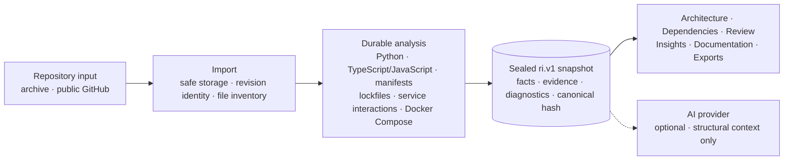

<p align="center">
  
</p>

<p align="center">
  <a href="#try-the-core-workflow">Try the workflow</a>
  ·
  <a href="#what-partha-is-aiming-to-become">Direction</a>
  ·
  <a href="#what-works-today">What works</a>
  ·
  <a href="#one-repository-model-many-consumers">How it works</a>
  ·
  <a href="#run-partha-locally">Run locally</a>
  ·
  <a href="#limitations-and-security">Limitations</a>
  ·
  <a href="docs/README.md">Docs</a>
  ·
  <a href="https://discord.gg/qvk9DcxDA">Discord</a>
</p>

<p align="center">
  
  
  
  <a href="https://discord.gg/qvk9DcxDA"></a>
</p>

**PARTHA turns a repository revision into one sealed, queryable model and uses it to explain architecture, dependencies, review findings, insights, and documentation without letting each feature invent its own interpretation.**

> **PARTHA runs locally today, with its flagship workflow usable end to end.** It is not yet a hardened shared hosted service — see [Limitations and security](#limitations-and-security) before any shared deployment.

PARTHA is for technical founders, staff and platform engineers, and engineering leads who need an inspectable starting point for understanding a codebase they did not write—or no longer fully trust their mental model of.

## What PARTHA is aiming to become

PARTHA is being built toward a private, versioned intelligence layer for software repositories. It should help people understand unfamiliar code faster and give AI a trusted, governed context instead of making it repeatedly reread the entire codebase.

Today, PARTHA analyzes a supported repository revision and produces an immutable `ri.v1` intelligence snapshot. Over time, the project is intended to support refresh, repository lineage, and cross-revision comparison so its understanding can remain current as the codebase evolves.

PARTHA can be self-hosted, and provider-backed AI is optional. AI consumes PARTHA's repository intelligence; it is not the independent source of truth.

## From scattered code to shared understanding

Understanding an unfamiliar or fast-moving codebase usually means reconstructing the same facts repeatedly: entry points from folders, dependencies from manifests, boundaries from imports, and risk from partial tooling. Documentation, static analysis, and AI can each build a different private interpretation—and those interpretations drift.

PARTHA takes a different approach. A bounded extraction pipeline turns the selected repository revision into a persistent Repository Intelligence snapshot. Architecture, Dependency Graph, Engineering Review, Insights, Documentation, exports, and optional AI all consume that shared model.

The result is a codebase view that is:

- **consistent across surfaces** — one stored fact model, not a parser per feature;
- **revision-bound** — a Git commit or uploaded-archive hash identifies the source;
- **inspectable** — supported facts carry extractor and source evidence;
- **honest about gaps** — unavailable or uncomputed assessments stay explicit.

## Try the core workflow

For the shortest path to value, [run PARTHA locally](#run-partha-locally) and use a real repository with Python or TypeScript/JavaScript code.

1. **Add a repository.** Upload a ZIP, TAR, TAR.GZ, or TGZ archive, or import a **public GitHub** repository over HTTPS.
2. **Run analysis.** PARTHA starts a durable, cancellable background job and seals a snapshot for that exact repository revision.
3. **Inspect the codebase from several angles.**
   - **Architecture** maps snapshot-backed modules and relationships in an interactive graph.
   - **Dependency Graph** inventories supported direct declarations and their manifest locations.
   - **Engineering Review** publishes only findings supported by stored evidence and keeps unassessed categories visible.
   - **Insights** reports defined snapshot-local counts, ratios, diagnostics, languages, and extractor coverage.
   - **Evidence Explorer** opens supported findings at the verified source span.
4. **Share the result.** Generate structural documentation or export Review, Documentation, Architecture, and Dependencies as JSON, Markdown, HTML, or PDF.

Across those surfaces, PARTHA keeps the repository revision, snapshot identity, and canonical graph hash aligned. A missing or stale snapshot produces an unavailable state instead of silently falling back to another interpretation.

## What works today

Statuses describe executable behaviour on the current `dev` branch:

<!-- BEGIN GENERATED CAPABILITY REGISTRY -->
| Capability | Status | Current boundary |
| --- | --- | --- |
| Archive upload and public GitHub import | **Implemented** | ZIP/TAR-family archives and shallow public GitHub HTTPS clones; size and path-safety limits apply. Private GitHub cloning and other repository hosts are not supported. |
| Repository explorer | **Implemented** | Owner-scoped file tree plus bounded text/image preview, binary detection, and truncation. |
| Authentication and owner isolation | **Implemented** | Email/password, Argon2, short-lived access tokens, rotating refresh tokens with reuse detection. Protected resources are owner-scoped; non-owner access returns 404. |
| Analysis lifecycle | **Implemented** | Database-backed, cancellable job with progress, bounded retry, lease renewal, and stale-worker recovery. |
| Repository Intelligence | **Implemented with disclosed limits** | Immutable, revision-addressed `ri.v1` snapshots with normalized facts, evidence, query APIs, and a total canonical graph hash. Semantic extraction is strongest for supported Python and TypeScript/JavaScript constructs. |
| Architecture and authentication explanation | **Implemented with disclosed limits** | Interactive snapshot-backed graph. Module/layer classification is heuristic. The cited authentication subgraph covers supported Python/FastAPI patterns only. |
| Dependency Graph | **Implemented with disclosed limits** | Direct declarations from `package.json`, `pyproject.toml`, and `requirements.txt` plus resolved pins from `package-lock.json` and `poetry.lock`, merged onto one dependency identity with repeated workspace declarations and exact spans. A lockfile pin is recorded as a resolution, never as a direct dependency edge, so transitive resolution is still not claimed. |
| Service-interaction discovery | **Implemented with disclosed limits** | Outbound HTTP call sites on `requests`, `httpx`, `fetch`, and `axios` resolve to a service node identified by its absolute origin, with the literal method and path on the call's own observation. A computed, relative, or shadowed destination is a diagnostic, never an edge. |
| Infrastructure-as-code resources | **Implemented with disclosed limits** | Declared Docker Compose services, volumes, and networks with their exact declaration spans. Templated values are disclosed rather than reported as observed, and no other IaC format is read. |
| Engineering Review | **Implemented with disclosed limits** | `engineering-review.v2`; evidence-addressed findings and explicit category states. No overall score, grade, health percentage, vulnerability result, or generated roadmap. |
| Repository Insights | **Implemented with disclosed limits** | `repository-insights.v1`; defined counts, ratios, diagnostics, language breakdowns, and extraction coverage from one snapshot. No change-over-time claims. |
| Documentation and report export | **Implemented with disclosed limits** | Documentation uses current-revision structural facts. Review, Documentation, Architecture, and Dependencies export through one JSON/Markdown/HTML/PDF pipeline. |
| AI provider integration | **Implemented with disclosed limits** | Per-user configuration for supported providers, encrypted API keys, and constrained outbound destinations. Free-form answers receive structural facts and observed paths—not source bytes or line spans—and return no automatic citations. |
| Asynchronous processing | **Implemented with disclosed limits** | Analysis runs off the request path. Import, extraction of the initial archive/clone, and file-tree parsing remain synchronous; one in-process worker handles analysis jobs. |
| Incremental re-analysis and revision comparison | **Planned** | The full repository is analysed again; no snapshot-to-snapshot product workflow is available. |
| Change-impact or blast-radius analysis | **Implemented with disclosed limits** | Owner-scoped traversal over one sealed snapshot's resolved import and dependency edges. It does not compare revisions or calculate churn or trends. |
| Vulnerability and outdated-dependency scanning | **Planned** | Dependency responses report explicit `not_computed` states; Review keeps vulnerability scanning `not_assessed`. No clean bill of health or zero count is fabricated. |
| Grounded, cited free-form AI answers | **Planned** | Provider answers are intentionally uncited because providers do not receive source content or line numbers. |

**Implemented with disclosed limits** means the workflow exists with an explicit coverage or trust boundary. **Planned** means it is roadmap work and current responses do not manufacture an answer. **Rejected** means the capability is intentionally outside the product contract.
<!-- END GENERATED CAPABILITY REGISTRY -->

## One repository model, many consumers

Repository Intelligence is PARTHA's single repository-understanding boundary. Repository source enters one bounded import and extraction path; product consumers query the resulting sealed snapshot rather than opening files or constructing parallel facts.

`ri.v1` is PARTHA's versioned, sealed Repository Intelligence snapshot: the product's single read model. Each immutable snapshot describes one repository at one exact revision and is identified by `repository_id`, `revision`, `schema_version`, `producer_version_set`, and `config_hash`; every fact carries a truth class and, where the contract requires it, provenance tied to an exact source location in that stored revision. Architecture, Dependency Graph, Review, Insights, Documentation, Exports, and AI consume the sealed snapshot instead of re-parsing repository files; if the current-revision snapshot is missing or stale, PARTHA reports it as unavailable rather than falling back to a parallel interpretation. The governing contract is the accepted [RFC-0001](docs/architecture/REPOSITORY_INTELLIGENCE_V1_RFC.md).



The architectural rule is deliberately strict:

> If a feature needs a repository fact, it belongs in the shared engine: extractors in `apps/backend/app/extraction/`, resolution and the sealed read model in `apps/backend/app/intelligence/`. A consumer must never build a second parser. AI is an optional downstream consumer of Repository Intelligence, never an independent interpreter of the repository.

### Evidence, provenance, and integrity

PARTHA separates three ideas that are often blurred together:

- **Evidence** is the stored source artifact supporting a fact, such as a file, declaration, import, route, or configuration entry.
- **Provenance** records where a supported fact came from: revision, path, line span, extractor, and fact identity.
- **Integrity** is represented by the snapshot's canonical graph hash and revision manifest. The digest detects content differences inside this deployment; it is **not** a digital signature or proof of authorship.

Coverage is surface-dependent. Supported extractors produce validated one-based inclusive line spans for Python and TypeScript/JavaScript facts; column-level evidence is not provided. Dependency declarations, the authentication explanation, and Review findings expose targeted evidence. Documentation uses structural facts, and free-form AI receives no source bytes or line numbers, so its prose has no automatic citations.

Read [Repository Intelligence](docs/architecture/REPOSITORY_INTELLIGENCE.md) for the complete extraction boundary and [System Overview](docs/architecture/SYSTEM_OVERVIEW.md) for the runtime architecture.

## Run PARTHA locally

### Prerequisites

| Tool | Version | Needed for |
| --- | --- | --- |
| Python | 3.12 or 3.13 | Backend |
| Node.js | 22 | Frontend and workflow scripts |
| Git | Recent version | Checkout and public GitHub import |

PARTHA currently uses separate backend and frontend development processes. The
development configuration uses SQLite, an in-memory rate limiter, and local
filesystem storage. No container runtime or external database is required.

### 1. Start the backend

No `.env` file is required.

```bash
git clone https://github.com/Second-Origin/PARTHA.git
cd PARTHA

cd apps/backend
python3.13 -m venv .venv
source .venv/bin/activate
pip install -e .
cd ../..

npm run dev:backend
```

The API starts at `http://localhost:8000`; OpenAPI is at `/docs` and readiness is at `/ready`.

### 2. Start the frontend

In a second terminal:

```bash
cd PARTHA
npm ci --prefix apps/frontend
npm run dev:frontend
```

Open `http://localhost:5173`, register a local account, add a repository, and
start analysis.

See the [AI provider egress policy](docs/security/AI_PROVIDER_EGRESS.md) before
configuring any custom or local provider endpoint.

For running every test/lint/build command and fixing the local database or
API-contract failures you're most likely to hit, see
[Local development and troubleshooting](docs/DEVELOPMENT.md).

## Verification

Run checks relevant to your change:

```bash
# Backend (avoids an inherited PYTHONPATH selecting the wrong environment)
cd apps/backend
PYTHONPATH= .venv/bin/python -m pytest
cd ../..

# Frontend
npm --prefix apps/frontend run test
npm run lint:frontend
npm run build:frontend

# Disposable fixtures and browser journeys
npm run test:e2e
```

The browser acceptance suite exercises defined Architecture, Engineering Review, Insights, evidence, and responsive-accessibility journeys. Passing it verifies those journeys; it does not imply complete product coverage.

## Limitations and security

### Product limitations

- **Trusted-environment use.** PARTHA has not been operated or hardened for broad shared hosting.
- **Narrow semantic coverage.** The capability registry declares the Python and TypeScript/JavaScript constructs that receive the deepest extraction. Other languages primarily contribute file inventory. Role, module, layer, framework, and entry-point classifications can be heuristic.
- **Narrow dependency coverage.** Direct declarations are extracted from three manifest formats, and exact pins from two lockfile formats (`package-lock.json`, `poetry.lock`) are recorded as resolutions on the same dependency identity. A pin is never promoted to a direct dependency edge, so transitive resolution is not claimed. Vulnerability scanning and outdated-version scanning are not implemented.
- **No repository evolution workflow.** Analysis is whole-repository; incremental analysis, revision comparison, and churn/trend analysis are unavailable. The sealed-snapshot impact query does not compare revisions or calculate historical change.
- **Surface-dependent evidence.** A sealed snapshot does not make every product sentence line-cited. In particular, generated structural documentation and free-form AI have stricter evidence limits.
- **In-process execution.** A daemon worker thread inside the API process handles one analysis job at a time; there is no separate worker service or external job queue.

### Security guidance

All non-auth product routes require authentication, repository access is owner-scoped, provider API keys are Fernet-encrypted at rest, and AI egress is validated against a deployment-owned allowlist with DNS pinning. These controls are meaningful, but they are not a claim of production hardening.

Outside `development` and `test`, the backend requires:

- `AUTH_SECRET_KEY` with at least 32 characters;
- `AI_ENCRYPTION_KEY` containing a valid Fernet key;
- independent network egress controls for AI providers.

Registration is gated by an admin-managed email allowlist, in every environment. On a genuinely fresh instance — an empty database, nobody pre-approved — the first account anyone registers (password or OAuth) is auto-approved automatically and becomes that instance's owner; this is what lets a self-hoster actually use their own deployment. Every registration after that first one needs an existing account holder to approve the email first, with `apps/backend/scripts/approve_email.py`.

Do not expose the development configuration directly to the public internet. Review [SECURITY.md](SECURITY.md) and the [AI provider egress policy](docs/security/AI_PROVIDER_EGRESS.md) before any shared deployment. Report vulnerabilities privately—never in a public issue.

## Documentation and contributing

- [Documentation index](docs/README.md) — current public documentation and reading paths.
- [Local development and troubleshooting](docs/DEVELOPMENT.md) — start the stack, run every test/lint/build command, and fix the failures a new contributor is most likely to hit.
- [System Overview](docs/architecture/SYSTEM_OVERVIEW.md) — components, runtime flow, persistence, and trust boundaries.
- [Repository Intelligence](docs/architecture/REPOSITORY_INTELLIGENCE.md) — extraction, snapshot, consumer, and evidence rules.
- [Accepted `ri.v1` RFC](docs/architecture/REPOSITORY_INTELLIGENCE_V1_RFC.md) — the versioned snapshot contract.
- [Repository Lineage RFC](docs/architecture/REPOSITORY_LINEAGE_RFC.md) — accepted design (RFC-0002) for grouping repeated imports of the same repository into a durable lineage. Design only: no table, column, or surface exists yet.
- [Backend guide](apps/backend/README.md) and [frontend guide](apps/frontend/README.md) — area-specific setup and commands.
- [CONTRIBUTING.md](CONTRIBUTING.md) — fork-first workflow, issue claiming, branch conventions, validation, and pull-request requirements.
- [CODE_OF_CONDUCT.md](CODE_OF_CONDUCT.md) — expected conduct.
- [Discord](https://discord.gg/qvk9DcxDA) — ask questions, follow progress, and talk with the community and maintainers.

Before changing analysis, parsing, or AI-grounding behaviour, read [Repository Intelligence](docs/architecture/REPOSITORY_INTELLIGENCE.md) in full. Current behaviour belongs in documentation; future work belongs in GitHub issues.

## License

PARTHA is available under the [Apache License 2.0](LICENSE).
