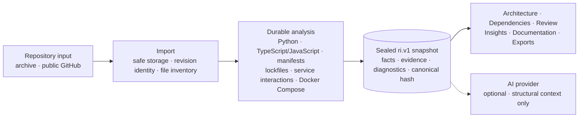

<p align="center">
  
</p>

<p align="center">
  <a href="#why-partha">Overview</a>
  ·
  <a href="#how-it-works">How it works</a>
  ·
  <a href="#quick-start">Quick start</a>
  ·
  <a href="docs/README.md">Docs</a>
  ·
  <a href="CONTRIBUTING.md">Contributing</a>
  ·
  <a href="https://discord.gg/qvk9DcxDA">Discord</a>
</p>

<p align="center">
  <a href="https://github.com/Second-Origin/PARTHA/releases/latest"></a>
  
  
  
  <a href="https://discord.gg/qvk9DcxDA"></a>
</p>

**PARTHA turns one repository revision into a sealed, queryable intelligence model, and serves architecture, dependencies, engineering review, insights, documentation, and AI context from that one model.**

It is for staff and platform engineers, technical founders, and engineering leads who need an inspectable starting point for a codebase they did not write — or no longer fully trust their mental model of. It runs self-hosted; provider-backed AI is optional.

## Why PARTHA

Understanding an unfamiliar or fast-moving codebase means reconstructing the same facts over and over: entry points from folders, dependencies from manifests, boundaries from imports, risk from partial tooling. Documentation, static analysis, and AI each build their own private interpretation, and those interpretations drift apart.

PARTHA builds the interpretation **once**. A bounded extraction pipeline turns the selected repository revision into a persistent Repository Intelligence snapshot, and every product surface — Architecture, Dependency Graph, Engineering Review, Insights, Documentation, exports, and optional AI — reads that shared model instead of re-parsing the code.

The result is a codebase view that is consistent across surfaces, bound to an exact Git commit or archive hash, inspectable back to source evidence, and explicit about what it could not determine. Where a fact cannot be proven, PARTHA says so rather than guessing.

## What PARTHA does

Each surface reads the sealed snapshot for the analysed revision:

- **Repository Intelligence** — builds an immutable, revision-addressed structural snapshot from supported repository sources, with evidence and provenance on supported facts.
- **Architecture** — an interactive graph of modules and resolved relationships, plus an evidence-cited authentication explanation for supported Python/FastAPI patterns.
- **Dependency Graph** — direct declarations from `package.json`, `pyproject.toml`, and `requirements.txt`, with resolved pins from two lockfile formats recorded as resolutions, never as direct edges.
- **Engineering Review** — findings that are each backed by a stored evidence span; unassessed categories stay visible. No score, grade, or health percentage.
- **Repository Insights** — defined counts, ratios, diagnostics, and coverage from one snapshot. No change-over-time claims.
- **Repository Lineage** — repeated imports of the same repository and branch grouped into a durable history, browsable through the API and UI. This is revision *history*, not cross-revision comparison.
- **Documentation & export** — structural documentation, and Review / Documentation / Architecture / Dependencies exported through one JSON / Markdown / HTML / PDF pipeline.
- **Optional AI context** — per-user provider configuration with encrypted keys and a deployment-owned egress allowlist. Providers receive structural facts and observed paths only — never source bytes or line spans — so answers carry no automatic citations.

The full contract, with every coverage and trust boundary stated per capability, is the
**[capability matrix](docs/CAPABILITIES.md)** — generated from the code and drift-checked in CI.

## Core workflow

```text
Import  →  Analyse  →  Explore  →  Export
```

1. **Import** — upload a ZIP/TAR-family archive, or import a public GitHub repository over HTTPS.
2. **Analyse** — PARTHA runs a durable, cancellable background job and seals a snapshot for that exact revision.
3. **Explore** — inspect Architecture, Dependencies, Engineering Review, Insights, evidence, and lineage. A missing or stale snapshot shows an unavailable state, never a fallback interpretation.
4. **Export** — generate structural documentation or export structured results.

## How it works



`ri.v1` is PARTHA's versioned, sealed snapshot — the single read model. Each immutable snapshot describes one repository at one exact revision; supported facts carry a truth class and, where the contract requires it, provenance tied to an exact source location. The architectural rule is strict:

> If a feature needs a repository fact, it belongs in the shared engine — never a second parser inside a consumer. AI is a downstream consumer of Repository Intelligence, never an independent interpreter of the repository.

Supported structural facts retain evidence and provenance back to their repository revision and source location; coverage is surface-dependent, and free-form AI is deliberately uncited. The snapshot's canonical graph hash detects content differences inside a deployment — it is not a digital signature.

**Read more:** [System Overview](docs/architecture/SYSTEM_OVERVIEW.md) · [Repository Intelligence](docs/architecture/REPOSITORY_INTELLIGENCE.md) · [RFC-0001 (`ri.v1` contract)](docs/architecture/REPOSITORY_INTELLIGENCE_V1_RFC.md) · [RFC-0002 (Repository Lineage)](docs/architecture/REPOSITORY_LINEAGE_RFC.md)

## Quick start

| Tool | Version | Needed for |
| --- | --- | --- |
| Python | 3.12 or 3.13 | Backend |
| Node.js | 22 | Frontend and workflow scripts |
| Git | recent | Checkout and public GitHub import |

Development uses SQLite, an in-memory rate limiter, and local filesystem storage. No container runtime or external database is required, and no `.env` file is needed.

```bash
git clone https://github.com/Second-Origin/PARTHA.git
cd PARTHA

# 1. Backend — http://localhost:8000  (OpenAPI at /docs, readiness at /ready)
cd apps/backend
python3.13 -m venv .venv && source .venv/bin/activate
pip install -e .
cd ../.. && npm run dev:backend

# 2. Frontend — http://localhost:5173  (second terminal)
npm ci --prefix apps/frontend
npm run dev:frontend
```

Open `http://localhost:5173`, register a local account, add a repository, and start analysis.

The [development guide](docs/DEVELOPMENT.md) covers the full test / lint / build / benchmark / Docker / E2E commands and the local database and API-contract failures you are most likely to hit. Review the [AI provider egress policy](docs/security/AI_PROVIDER_EGRESS.md) before configuring any custom or local provider endpoint.

## Current limitations

- **Trusted-environment use.** PARTHA has not been operated or hardened for broad shared or multi-tenant hosting. Do not expose the development configuration to the public internet.
- **Narrow semantic coverage.** The deepest extraction is for supported Python and TypeScript/JavaScript constructs; other languages contribute file inventory. Role, module, layer, framework, and entry-point classification can be heuristic.
- **Narrow dependency coverage.** Three manifest formats and two lockfile formats; no transitive resolution, no vulnerability or outdated-version scanning.
- **Whole-repository analysis.** Every analysis re-reads the whole repository. There is no incremental re-analysis.
- **No cross-revision comparison.** Lineage preserves revision history; it does not diff two snapshots, detect renames or moves, or compute a historical blast radius. Change-impact analysis is single-snapshot structural traversal only.
- **Optional AI can be external.** Depending on configuration, AI calls a configured provider; only local providers keep everything on the host. See the [egress policy](docs/security/AI_PROVIDER_EGRESS.md).
- **In-process worker.** One daemon worker thread inside the API process handles one analysis job at a time; there is no separate worker service or job queue.

Non-auth product routes require authentication, repository access is owner-scoped, provider keys are Fernet-encrypted at rest, and AI egress is validated against a deployment-owned allowlist with DNS pinning — meaningful controls, but not a claim of production hardening. See [SECURITY.md](SECURITY.md) and [`docs/CAPABILITIES.md`](docs/CAPABILITIES.md) for the details.

## Documentation

- [Documentation index](docs/README.md) — every guide, with reading paths
- [Capability matrix](docs/CAPABILITIES.md) — the detailed, generated capability contract
- [System Overview](docs/architecture/SYSTEM_OVERVIEW.md) — components, runtime flow, persistence, trust boundaries
- [Repository Intelligence](docs/architecture/REPOSITORY_INTELLIGENCE.md) — extraction, snapshot, consumer, and evidence rules
- [Local development](docs/DEVELOPMENT.md) — running, testing, and troubleshooting the stack
- [Connecting an AI provider](docs/operations/AI_PROVIDER_SETUP.md) · [AI provider egress policy](docs/security/AI_PROVIDER_EGRESS.md)
- [Roadmap](ROADMAP.md) · [Governance](GOVERNANCE.md) · [Security policy](SECURITY.md)

## Contributing

Issues and pull requests are welcome. Start with [CONTRIBUTING.md](CONTRIBUTING.md) for the fork-first workflow, branch conventions, and Definition of Ready / Done, then pick up a [good first issue](https://github.com/Second-Origin/PARTHA/issues?q=is%3Aissue+is%3Aopen+label%3A%22good+first+issue%22). Before changing analysis, parsing, or AI-grounding behaviour, read [Repository Intelligence](docs/architecture/REPOSITORY_INTELLIGENCE.md) in full.

## Community

- [Discord](https://discord.gg/qvk9DcxDA) — questions, progress, and discussion with maintainers
- [Issues](https://github.com/Second-Origin/PARTHA/issues) — bugs and feature requests

## Releases

`main` carries the latest tagged release; `dev` is where active development happens and is the target of every pull request. PARTHA is pre-1.0, so minor versions may change behaviour — each release's notes say what moved. See [all releases](https://github.com/Second-Origin/PARTHA/releases), the [changelog](CHANGELOG.md), and [CONTRIBUTING § Releases](CONTRIBUTING.md#14-releases).

## License

PARTHA is available under the [Apache License 2.0](LICENSE).
