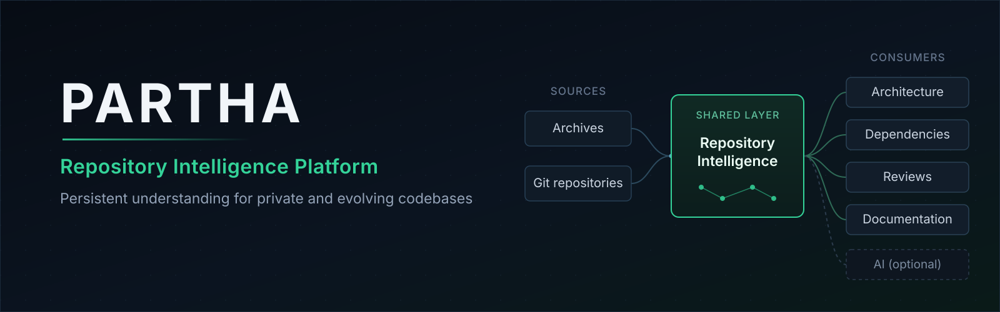
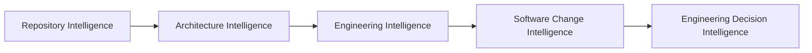
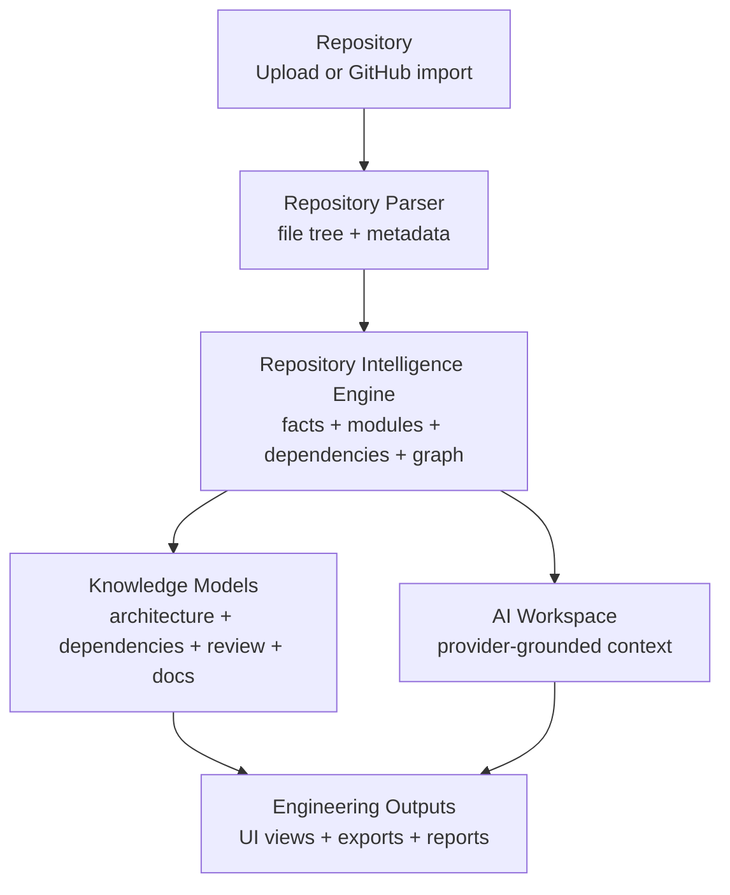
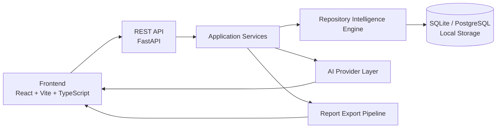
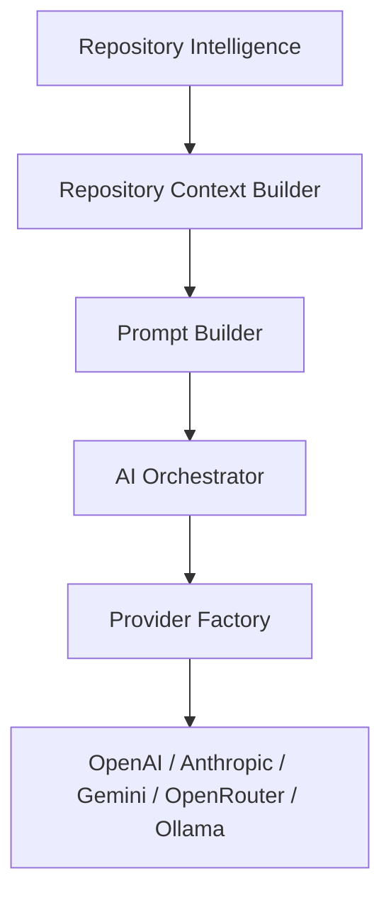
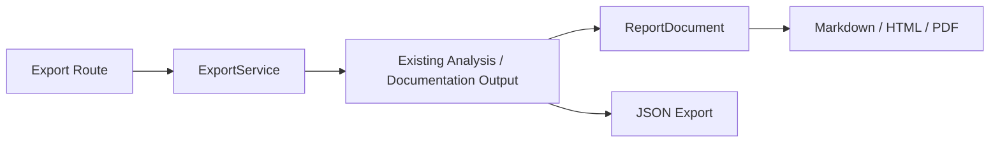
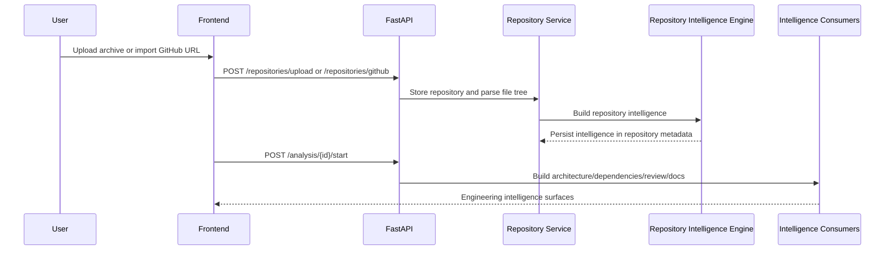

<p align="center">
  
</p>

<p align="center">
  
</p>

<h1 align="center">PARTHA</h1>

<p align="center">
  <strong>Engineering Intelligence Platform</strong>
</p>

<p align="center">
  Transform repositories into actionable engineering intelligence.
  <br>
  Understand systems, assess change impact, and make engineering decisions with confidence.
</p>

<p align="center">
  <a href="#quick-start">Quick Start</a>
  ·
  <a href="#core-capabilities">Capabilities</a>
  ·
  <a href="#architecture">Architecture</a>
  ·
  <a href="docs/README.md">Docs</a>
  ·
  <a href="CONTRIBUTING.md">Contributing</a>
</p>

<p align="center">
  
  
  
  
  
  
</p>

---

## Why PARTHA Exists

Modern software systems do not fail because engineers lack files. They fail because repository knowledge is fragmented.

Architecture lives in code paths, dependency manifests, framework conventions, deployment files, API routes, tests, docs, and local team memory. As repositories grow, teams repeatedly ask the same questions:

- Where does this system start?
- Which modules own which responsibilities?
- Which dependencies matter?
- What files should a new contributor read first?
- What does this architecture imply for the next change?
- Where is the technical debt, and what evidence supports it?
- How can AI answer questions without guessing from raw files?

PARTHA exists to turn software repositories into reusable engineering knowledge.

The key idea is simple:

> Analyse a repository once, build a repository intelligence layer, and let every product surface consume the same source of truth.

PARTHA is not an AI chatbot, a repository summarizer, or a documentation generator. Those are surfaces. The platform is an Engineering Intelligence system built on Repository Intelligence.

---

## Vision

PARTHA’s long-term direction is Engineering Decision Intelligence.



Today, PARTHA focuses on the first layers: importing repositories, deriving reusable repository facts, generating architecture/dependency/review/documentation views, exporting reports, and grounding AI providers in repository context.

The goal is not to replace engineers. The goal is to make the engineering context visible, consistent, and reviewable.

---

## Core Capabilities

PARTHA is organised around engineering capabilities rather than individual screens.

| Capability | Current implementation | Status |
| --- | --- | --- |
| Repository Intelligence | Imports uploaded archives or public GitHub repositories, builds file trees, metadata, discovery facts, source-file intelligence, modules, dependencies, and a serialized knowledge graph. | Implemented / expanding |
| Architecture Intelligence | Builds an architecture model from repository intelligence, including modules, layers, relationships, summaries, request-flow hints, and frontend graph exploration. | Implemented heuristically |
| Dependency Intelligence | Reads dependency manifests through the Repository Intelligence Engine and returns dependency inventory/graph responses. Vulnerability and outdated checks are not implemented yet. | Partial |
| Documentation Intelligence | Generates Markdown or HTML documentation from repository facts, architecture, dependency, deployment, environment, and contribution signals. | Implemented / basic |
| Engineering Reviews | Produces heuristic findings, category scores, evidence-backed affected files/modules, and roadmap suggestions from repository intelligence. | Implemented heuristically |
| AI Workspace | Lets configured AI providers answer repository-aware questions from structured repository context. Providers do not parse repositories directly. | Implemented |
| Reports and Exports | Exports engineering review, documentation, architecture, and dependencies as JSON, Markdown, HTML, or PDF through a shared report pipeline. | Implemented |
| Platform Foundation | Provides Docker Compose, CI, release workflow, health/readiness, request IDs, metrics, structured logging, and environment validation. | Implemented baseline |

PARTHA intentionally avoids claiming deeper capabilities before they exist. Change-impact analysis, richer semantic graphs, vulnerability scanning, authentication, and multi-user deployment controls are roadmap items.

---

## System Overview



Repository Intelligence is the source of truth. Downstream features consume it; they should not re-parse repositories independently.

---

## Architecture

PARTHA is a monorepo with a React frontend and FastAPI backend.



### Subsystems

| Subsystem | Responsibility |
| --- | --- |
| Frontend | App shell, repository dashboard, upload/import, explorer, architecture graph, dependency view, review workspace, documentation workspace, AI workspace, settings, and export actions. |
| Backend API | Stable HTTP boundary for repositories, analysis, documentation, export, AI, health, readiness, and metrics. |
| Repository Service | Imports repositories, stores records, exposes file tree and safe file-preview access. |
| Repository Intelligence Engine | Builds reusable repository facts from parser output and source files. |
| Architecture Service | Converts repository intelligence into architecture graph response models. |
| Dependency Service | Converts repository intelligence dependencies into dependency graph response models. |
| Documentation Service | Generates documentation documents from existing repository intelligence and analysis outputs. |
| Engineering Review Service | Produces heuristic findings, scores, and roadmap suggestions from repository intelligence. |
| AI Layer | Builds structured repository context, prompt bundles, and provider-agnostic orchestration. |
| Provider Layer | Dedicated provider implementations for OpenAI, Anthropic, Gemini, OpenRouter, and Ollama. |
| Export Pipeline | Uses `ReportDocument` as an intermediate representation and renders JSON, Markdown, HTML, or PDF. |
| Storage | Uses SQLite by default for local development, PostgreSQL in Docker Compose, and local filesystem storage for repositories/uploads. |
| Platform Foundation | CI, Docker Compose validation, release workflow, health/readiness, request IDs, metrics, and structured logs. |

### AI Architecture Boundary

AI providers are consumers of Repository Intelligence, not producers of it.



Provider implementations own HTTP requests, authentication, response parsing, and error normalization. They do not read repository files or rebuild analysis.

### Export Architecture Boundary



The export pipeline consumes existing analysis output. It does not re-analyse repositories.

---

## Repository Workflow



---

## Screenshots

Screenshots will be added when the public demo UI is ready.

| Surface | Placeholder |
| --- | --- |
| Repository Dashboard | Upload and inspect repositories. |
| Architecture Intelligence | Explore modules, layers, relationships, and request-flow hints. |
| Engineering Review | Review findings, scores, evidence, and roadmap suggestions. |
| AI Workspace | Ask repository-grounded questions through configured providers. |
| Reports | Export architecture, dependency, documentation, and review artifacts. |

---

## Quick Start

### Prerequisites

| Tool | Version |
| --- | --- |
| Node.js | 22 or newer recommended |
| npm | Bundled with Node.js |
| Python | 3.12 or 3.13 |
| Docker | Required for Compose-based PostgreSQL/Redis workflow |
| Git | Required for GitHub repository import |

### Clone and Install

```bash
git clone https://github.com/Second-Origin/PARTHA.git
cd PARTHA
npm ci --prefix apps/frontend
cd apps/backend
python3.13 -m venv .venv
source .venv/bin/activate
pip install -e .
cd ../..
```

### Configure Environment

```bash
cp .env.example .env
cp apps/frontend/.env.example apps/frontend/.env
cp apps/backend/.env.example apps/backend/.env
```

The backend local example uses SQLite and local filesystem storage so direct local startup works without PostgreSQL or Redis. Docker Compose injects container-specific PostgreSQL, Redis, and storage values.

### Run Locally

```bash
npm run dev:backend
npm run dev:frontend
```

Open:

- frontend: `http://localhost:5173`
- backend docs: `http://localhost:8000/docs`
- readiness: `http://localhost:8000/ready`
- metrics: `http://localhost:8000/metrics`

---

## Local Development

Common commands:

```bash
npm run dev:frontend
npm run dev:backend
npm run lint:frontend
npm run build:frontend
npm run test:backend
npm run build
```

Backend helper scripts prefer `apps/backend/.venv` when present and fall back to `python`.

---

## Docker

Validate the Docker Compose configuration:

```bash
npm run docker:config
```

Run Compose with runtime readiness validation:

```bash
npm run docker:validate
```

Start the Compose stack for local infrastructure:

```bash
npm run docker:up
```

The Compose stack runs:

| Service | Port |
| --- | --- |
| API | `8000` |
| PostgreSQL | `5432` |
| Redis | `6379` |

Run the frontend separately with `npm run dev:frontend`.

---

## Technology Decisions

PARTHA uses pragmatic, inspectable tools rather than opaque infrastructure.

| Decision | Why |
| --- | --- |
| React + Vite + TypeScript | Fast local iteration, typed frontend contracts, and a clean app/feature/shared structure. |
| FastAPI + Pydantic | Explicit request/response schemas, OpenAPI generation, and straightforward service boundaries. |
| SQLAlchemy + Alembic | Portable persistence across SQLite local development and PostgreSQL-backed deployments. |
| Repository Intelligence Engine | Centralizes repository facts so architecture, docs, reviews, exports, and AI do not drift. |
| Tree-sitter foundation | Provides a path toward deeper language-aware extraction while preserving heuristic fallbacks. |
| Provider abstraction | Keeps AI orchestration provider-agnostic and prevents providers from parsing repositories. |
| ReportDocument pipeline | Separates report construction from rendering so new export formats can be added safely. |
| Docker Compose | Provides reproducible local backend infrastructure without requiring production hosting decisions. |

---

## Project Structure

```text
PARTHA/
├── apps/
│   ├── backend/                 FastAPI backend
│   └── frontend/                React frontend
├── docs/
│   ├── architecture/            System and subsystem architecture docs
│   ├── assets/                  Public README and brand assets
│   ├── audit/                   Engineering audit records
│   ├── brand/                   Visual identity guidance
│   ├── operations/              Deployment, observability, release, dependencies
│   └── product/                 Product/public-face audits
├── packages/                    Reserved for future shared packages
├── scripts/                     Local workflow helpers
├── docker-compose.yml           Local API/PostgreSQL/Redis stack
├── package.json                 Root workspace scripts
└── CONTRIBUTING.md              Contributor guide
```

Backend responsibilities:

| Path | Responsibility |
| --- | --- |
| `app/api/` | Routes and dependency wiring. |
| `app/services/` | Application services. |
| `app/intelligence/` | Repository Intelligence Engine and models. |
| `app/analysis/` | Architecture modelling. |
| `app/graph/` | Dependency graph construction. |
| `app/review/` | Engineering review generation. |
| `app/ai/` | AI orchestration, context, prompts, and providers. |
| `app/reports/` | Report document model, builders, renderers, export service. |
| `app/storage/` | Local repository/upload storage. |

Frontend responsibilities:

| Path | Responsibility |
| --- | --- |
| `src/app/` | App shell, routes, pages, and global store. |
| `src/features/` | Domain-specific hooks, state, and components. |
| `src/shared/` | Reusable UI, API clients, config, hooks, types, and utilities. |
| `src/styles/` | Global styling and design tokens. |

---

## Documentation

Start here:

| Document | Purpose |
| --- | --- |
| `docs/README.md` | Documentation index. |
| `docs/product/PUBLIC_FACE_AUDIT.md` | Repository, documentation, and positioning audit for this public-face redesign. |
| `docs/brand/VISUAL_IDENTITY.md` | Visual identity, colors, logo, diagrams, and documentation style. |
| `docs/architecture/REPOSITORY_INTELLIGENCE_ENGINE.md` | Repository Intelligence Engine architecture and boundaries. |
| `docs/architecture/AI_ARCHITECTURE.md` | AI architecture, provider layer, context, and prompt flow. |
| `docs/operations/production-deployment.md` | Production deployment baseline and operational limits. |
| `docs/operations/observability.md` | Request IDs, logs, redaction, metrics, readiness. |
| `docs/operations/release-management.md` | Versioning and release workflow. |
| `docs/operations/dependency-management.md` | Dependency maintenance policy. |

---

## Roadmap

### Current Milestone

Vrrently building the foundation for Repository Intelligence and Engineering Intelligence:

- repository ingestion and safe file preview;
- reusable repository intelligence;
- architecture/dependency/review/documentation consumers;
- AI provider integration grounded in repository context;
- report exports;
- operational baseline for local and controlled deployments.

### Future Milestones

| Milestone | Direction |
| --- | --- |
| Richer Repository Intelligence | Deeper symbol extraction, relationship detection, persisted graph artifacts, and language-aware analysis. |
| Software Change Intelligence | Impact analysis, affected modules, dependency-aware change planning, and review assistance. |
| Engineering Decision Intelligence | Decision support based on architecture, dependencies, risk, ownership, and repository history. |
| Production Multi-User Platform | Authentication, authorization, teams, retention policies, secret management, audit trails, and hosted deployment controls. |

### Current Non-Goals

PARTHA does not yet provide public multi-user SaaS controls, vulnerability scanning, deep semantic change-impact analysis, or full OpenTelemetry tracing.

---

## Contributing

PARTHA welcomes focused engineering contributions that preserve the Repository Intelligence boundary.

Start with:

- `CONTRIBUTING.md` for setup, branch strategy, issue workflow, pull request process, testing, and documentation standards.
- `docs/architecture/REPOSITORY_INTELLIGENCE_ENGINE.md` before changing analysis behavior.
- `docs/architecture/AI_ARCHITECTURE.md` before changing AI behavior.

Key rule:

> If a feature needs repository facts, add reusable extraction to Repository Intelligence first. Do not create a second parser inside a feature.

---

## Project Identity

PARTHA is the public product name.

The internal expansion is:

> Platform for Architecture, Repository Intelligence, Transformation & Heuristic Analysis

The expansion explains the project origin, but the public brand should remain simple: **PARTHA — Engineering Intelligence Platform**.

---

## License

MIT
