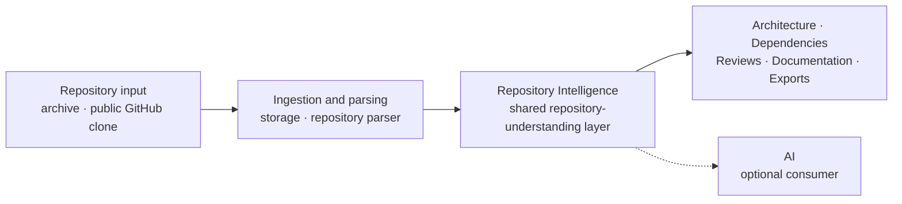
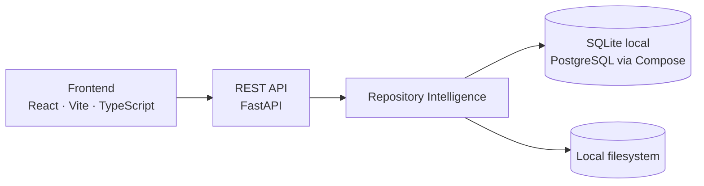

<p align="center">
  
</p>

<p align="center">
  <a href="#getting-started">Getting started</a>
  ·
  <a href="#what-currently-works">What works</a>
  ·
  <a href="#how-the-system-works">How it works</a>
  ·
  <a href="#limitations">Limitations</a>
  ·
  <a href="docs/README.md">Docs</a>
  ·
  <a href="CONTRIBUTING.md">Contributing</a>
</p>

<p align="center">
  
  
  
  
  
</p>

---

## What PARTHA is

**A self-hosted Repository Intelligence Platform for private and evolving codebases.**

PARTHA parses a repository once into a shared layer of repository facts, and has every surface — architecture, dependencies, reviews, documentation, exports, and optional AI — read from that one layer rather than deriving its own.

> **Repository Intelligence is the shared repository-understanding layer. AI is an optional downstream consumer of it, never an independent interpreter of the repository.**

The purpose, stated at the level it is actually being pursued: build *persistent* understanding of a repository as it evolves, reuse that understanding across every surface, and make repository claims progressively more checkable. PARTHA is early. What follows describes what exists, not what is intended.

> **Status: early development.** PARTHA runs locally and is useful for exploring a repository. It is **not production-ready**. Authentication and owner isolation are now enforced across the backend routes, but the system has not been hardened or operated as a multi-tenant deployment, so it should still be run in a trusted environment.

## The problem

- **Architecture is implicit.** Module boundaries, layering, and entry points live in folder conventions and framework idioms, not in anything you can read.
- **Dependencies are scattered** across manifests, imports, config, and container files.
- **Documentation goes stale**, and nobody can tell which parts still hold.
- **AI explanations are hard to trust** when the assistant reads raw files and guesses, giving you no way to check its answer.

The common failure is that each tool re-derives its own private understanding of the repository, and they quietly disagree. PARTHA's answer is to derive it once, in one place, and make everything else a consumer.

---

## What currently works

Statuses below were checked against the implementation, not against prior documentation.

| Capability | Status | Notes |
| --- | --- | --- |
| Archive upload (`.zip`, `.tar.gz`, `.tgz`) | **Implemented** | Size caps; path-traversal and symlink escape rejected; empty and invalid archives rejected. |
| Public GitHub import | **Implemented** | Shallow clone of public HTTPS GitHub URLs, with clone timeout and size cap. Records the HEAD commit. Private repositories and other hosts are not supported. |
| Repository explorer and file preview | **Implemented** | File tree, text and image preview, binary detection, truncation of large files. |
| Documentation and report export | **Implemented** | JSON, Markdown, HTML, and PDF through a shared report pipeline. |
| Authentication and frontend session flow | **Implemented** | Email/password with Argon2, short-lived access tokens, rotating refresh tokens with reuse detection. All frontend routes are behind an auth guard. |
| Repository Intelligence | **Implemented but limited** | A durable analysis job preserves a legacy compatibility model and seals normalized, revision-addressed Python/TypeScript facts with evidence. Architecture, authentication explanation, Engineering Review, Insights, and Dependency Graph consume the sealed snapshot. |
| Architecture output | **Implemented but limited** | Snapshot-backed nodes and relationships in a readable interactive graph. Module and layer classification remains a disclosed heuristic. |
| Dependency inventory | **Implemented but limited** | Snapshot-bound direct declarations from `package.json`, `requirements.txt`, and `pyproject.toml`, including a package declared in more than one manifest. No lockfiles, no transitive resolution, and no vulnerability or outdated-version scanning. |
| Engineering review | **Implemented but limited** | Deterministic `engineering-review.v2` findings only when the selected sealed snapshot supplies an exact fact and source span. Unassessed categories stay explicit; no score, grade, percentage, or invented roadmap is produced. |
| Repository insights | **Implemented but limited** | Defined counts, ratios, diagnostics, language and extractor breakdowns from one sealed snapshot. Trend and change-over-time metrics are explicitly unavailable. |
| AI provider integration | **Implemented but limited** | Several providers behind one abstraction. Provider configuration is per-user, with the API key encrypted at rest and injected per request; outbound destinations are centrally allowlisted and DNS-pinned. See [AI provider egress policy](docs/security/AI_PROVIDER_EGRESS.md). |
| Authorization and owner isolation | **Implemented** | All repository, analysis, AI, documentation, and export routes require authentication and are owner-scoped in the service layer; a non-owner request returns 404. Rate-limit budgets are keyed per authenticated user. |
| Evidence-backed authentication explanation | **Implemented but limited** | A deterministic Python/FastAPI authentication subgraph cites snapshot-, fact-, revision-, and line-addressed source. Classification remains heuristic and unsupported patterns are reported as gaps. |
| Grounded AI answers | **Not implemented** | No source content or line numbers are sent to providers, and no AI citations are returned. |
| Asynchronous / incremental processing | **Partially implemented** | Import and initial file-tree parsing remain synchronous. Analysis runs in a durable, cancellable background job with progress, bounded retry, and stale-worker recovery; incremental re-analysis is not implemented. |
| Change-impact analysis | **Not implemented** | — |
| Vulnerability and outdated-dependency scanning | **Not implemented** | The API exposes explicit `not_computed` assessment statuses. It emits no clean result or count because no scanning is performed. |
| Persistent semantic knowledge graph | **Implemented but limited** | Analysis seals normalized `ri.v1` snapshot tables with provenance and query APIs for Python/TypeScript facts. Several product consumers still use the legacy JSON compatibility model. |

A capability is listed as implemented only where the behaviour exists in code — not because a model, an API field, a class name, or an issue describes it.

---

## Evidence and provenance

Two terms PARTHA uses precisely, because the difference decides how far a claim can be trusted.

- **Evidence** is the source artifact supporting a repository fact: a file, declaration, import, route, or configuration entry.
- **Provenance** identifies where the fact came from: repository revision, path, symbol, line span, and extraction method.

**PARTHA currently provides partial, surface-dependent evidence and provenance.** Normalized `ri.v1` facts from supported Python and TypeScript extraction carry a repository revision, fact identity, path, line span, and extractor version. Architecture, the authentication explanation, Engineering Review, and Insights bind their output to one sealed snapshot. Review findings link to the exact stored fact/span; the Explorer verifies that destination and stored source-byte hash before displaying a trusted revision badge.

Legacy compatibility facts and several consumers still lack that traceability. AI receives no source content or line numbers and returns no citations. Extraction covers only documented syntax, and role classifications remain explicitly heuristic. Treat inferred output as a lead to verify, not a guarantee.

---

## How the system works

A repository is parsed once at ingestion. Repository Intelligence is built from that parse, persisted, and read back by every surface.



Consumers transform Repository Intelligence into their own response shapes. None of them opens repository files or re-parses the tree, and the export pipeline is a second-order consumer that renders analysis output that already exists.

> **The rule.** If a feature needs a repository fact, add reusable extraction to `app/intelligence/`. Do not build a second parser inside a consumer.

### Runtime shape



Deeper detail lives in [System Overview](docs/architecture/SYSTEM_OVERVIEW.md) and [Repository Intelligence](docs/architecture/REPOSITORY_INTELLIGENCE.md).

---

## Repository structure

```text
PARTHA/
├── apps/
│   ├── backend/              FastAPI backend
│   │   ├── app/
│   │   │   ├── api/          Routes and dependency wiring
│   │   │   ├── intelligence/ Repository Intelligence engine and models
│   │   │   ├── parsers/      File-tree parser
│   │   │   ├── analysis/     Architecture modelling (consumer)
│   │   │   ├── graph/        Dependency graph construction (consumer)
│   │   │   ├── review/       Engineering review (consumer)
│   │   │   ├── ai/           Orchestration, context, prompts, providers (consumer)
│   │   │   ├── reports/      Report model, renderers, export service
│   │   │   ├── auth/         Password hashing, tokens, auth service
│   │   │   ├── core/         Config, database, logging, rate limiting, security headers
│   │   │   ├── models/       SQLAlchemy models
│   │   │   └── storage/      Local repository and upload storage
│   │   ├── alembic/          Database migrations
│   │   └── tests/            Backend tests
│   └── frontend/             React frontend
│       └── src/
│           ├── app/          Shell, router, pages, stores
│           ├── features/     Domain features
│           └── shared/       API clients, UI, config, types, utilities
├── docs/                     Public documentation
├── packages/                 Reserved for future shared packages
├── scripts/                  Local workflow helpers
└── docker-compose.yml        Local development stack
```

---

## Getting started

| Tool | Version |
| --- | --- |
| Python | 3.12 or 3.13 |
| Node.js | 22 |
| Git | Required for GitHub repository import |
| Docker | Optional, for the local Compose stack |

### Backend

The backend defaults to SQLite and local filesystem storage, so it starts with no PostgreSQL and no Redis.

```bash
git clone https://github.com/Second-Origin/PARTHA.git
cd PARTHA

cd apps/backend
python3.13 -m venv .venv
source .venv/bin/activate
pip install -e .
cd ../..

npm run dev:backend
```

The API is then on `http://localhost:8000` — OpenAPI docs at `/docs`, readiness at `/ready`.

No `.env` file is required for local development: every setting has a working default. Copy `apps/backend/.env.example` only when you want to change one.

### Frontend

```bash
npm ci --prefix apps/frontend
npm run dev:frontend
```

The app is then on `http://localhost:5173` and expects the backend on `http://localhost:8000`. Register an account through the UI, then sign in.

### Docker Compose (local development only)

Compose runs the API against PostgreSQL and Redis for local development. It is not deployment guidance.

The API provider egress policy defaults to `hosted`, which does not enable a
tenant-configurable local endpoint. A trusted local or internal Ollama endpoint
requires explicit administrator-owned `AI_EGRESS_MODE=self_hosted`, exact base
URL, and CIDR settings. Compose isolates PostgreSQL and Redis on an internal
data network, but it cannot enforce an exact API destination allowlist; hosted
and shared deployments still require a firewall, egress proxy, cloud rule, or
service-mesh policy. See [AI provider egress policy](docs/security/AI_PROVIDER_EGRESS.md).

```bash
npm run docker:config     # validate the Compose file
npm run docker:up         # start the local stack
npm run docker:validate   # start, wait for /ready, tear down
```

Run the frontend separately with `npm run dev:frontend`.

---

## Testing

```bash
npm run test:backend                  # backend tests (pytest)
npm --prefix apps/frontend run test   # frontend tests (vitest)
npm run lint:frontend                 # eslint
npm run build:frontend                # tsc -b && vite build
npm run test:prototype                # disposable fixtures + Playwright journeys
```

`npm run build` runs the frontend build and the backend tests; it does not run
frontend lint, Vitest, or the prototype browser journeys, so run those
separately. CI runs all of the above plus the disposable Playwright acceptance
job and a Docker Compose check.

The executable prototype acceptance suite exercises the review-ready
Architecture, Engineering Review, and Insights journeys against disposable
analyzed repositories. Passing tests demonstrate those defined journeys, not
complete product maturity.

---

## Limitations

- **Not yet hardened for public multi-tenant use.** Authentication and owner isolation are enforced across the backend routes, provider keys are encrypted at rest, and AI provider egress is centrally constrained, but PARTHA has not been operated as a hardened multi-tenant deployment. It is not production-ready and should not be exposed to the public internet without further review. Outside `development`/`test`, set `AUTH_SECRET_KEY` and `AI_ENCRYPTION_KEY` (a Fernet key); the backend refuses to start without them. Production also needs an independent network egress control; application validation is not a firewall.
- **Extraction is heuristic.** File roles, modules, and layers are inferred from paths and filenames; symbols come from regular expressions. Expect wrong answers on projects that do not follow common conventions, and do not treat heuristic output as guaranteed fact.
- **Evidence and provenance are partial at the product layer.** Architecture, Engineering Review, Insights, and Dependency Graph bind output to sealed snapshots and expose the provenance they use. Documentation, exports, and AI answers do not all consume that model yet.
- **The persistent graph is not the only read model yet.** Durable analysis seals queryable `ri.v1` snapshots, while Documentation, exports, and AI still read serialized legacy intelligence from the repository row.
- **Analysis is whole-repository.** It now runs as a cancellable background job, but there is no incremental re-analysis.
- **No change-impact analysis, and no vulnerability or outdated-dependency scanning.**
- **AI answers are not evidence-backed.** They are grounded in repository structure and file paths only, with no citations. Treat them as a hypothesis to verify.

---

## Contributing and security

- **[CONTRIBUTING.md](CONTRIBUTING.md)** — the contribution rules: fork-first workflow, claiming an issue, branch naming, rebasing, pull requests, and the Definition of Ready and Done. Read it before opening a PR.
- **[SECURITY.md](SECURITY.md)** — report a vulnerability privately. Never open a public issue for one.
- **[CODE_OF_CONDUCT.md](CODE_OF_CONDUCT.md)** — expected conduct.
- **[docs/README.md](docs/README.md)** — documentation index.

Before changing analysis behaviour, read [Repository Intelligence](docs/architecture/REPOSITORY_INTELLIGENCE.md). That boundary is the one architectural rule this project will not bend on.

Current behaviour belongs in documentation. Future work belongs in GitHub issues.

---

## License

PARTHA is licensed under the Apache License 2.0. See [LICENSE](LICENSE) for the full text.
