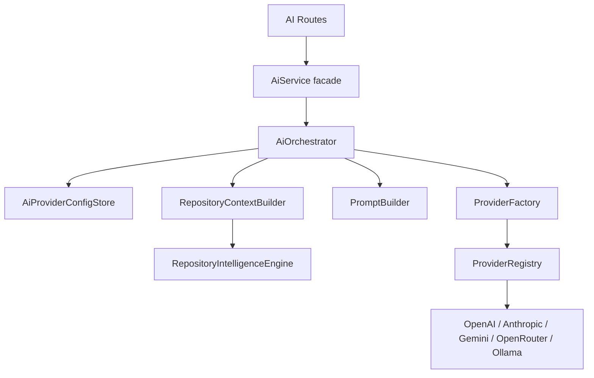
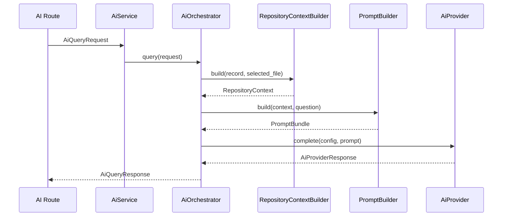
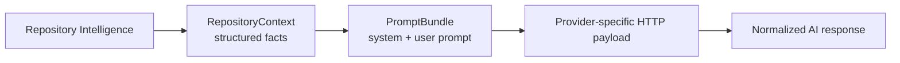

# AI Architecture

PARTHA's AI subsystem is designed around one rule:

> AI providers consume Repository Intelligence. They never parse repositories directly.

The current implementation supports configured providers, provider connection testing, repository-grounded query prompts, citations from repository context, and a compatibility streaming endpoint.

## Goals

- Keep Repository Intelligence as the single source of repository understanding.
- Keep providers behind a common abstraction.
- Keep orchestration provider-agnostic.
- Preserve the existing `/ai/*` API contract and behaviour.

## Component Responsibilities

| Component | Responsibility | Must not do |
| --- | --- | --- |
| `AiService` | Route-facing compatibility facade. | Build prompts, read repository intelligence, or call providers directly. |
| `AiOrchestrator` | Coordinate query and provider-test lifecycles. | Contain provider-specific HTTP logic. |
| `AiProviderConfigStore` | Preserve current file-backed provider configuration behaviour. | Redesign secret storage or persistence. |
| `RepositoryContextBuilder` | Transform `RepositoryIntelligence` into provider-safe `RepositoryContext`. | Parse repositories or read dependency manifests. |
| `PromptBuilder` | Transform `RepositoryContext` and user question into `PromptBundle`. | Format provider-specific payloads. |
| `ProviderRegistry` | Register dedicated provider implementations by provider id. | Instantiate providers from request data. |
| `ProviderFactory` | Resolve a provider implementation from validated configuration. | Know provider HTTP details. |
| Dedicated providers | Preserve provider-specific HTTP behaviour behind `AiProvider`. | Access Repository Intelligence or change prompt construction. |
| `LegacyProvider` | Preserve the previous provider implementation as a compatibility reference. | Be registered for runtime provider resolution. |

## Dependency Graph



## Request Lifecycle



Steps:

1. API route receives an existing `AiQueryRequest`.
2. `AiService.query()` delegates to `AiOrchestrator.query()`.
3. The orchestrator loads the repository record.
4. The orchestrator loads the saved provider configuration.
5. `RepositoryContextBuilder` builds a structured `RepositoryContext` from Repository Intelligence.
6. `PromptBuilder` builds a structured `PromptBundle`.
7. `ProviderFactory` resolves the configured provider.
8. The provider returns a normalized `AiProviderResponse`.
9. The orchestrator returns the existing `AiQueryResponse` shape.

## Repository Context Boundary

Providers consume `RepositoryContext` through `PromptBundle`.

Providers must not:

- parse repositories;
- read repository files;
- call `RepositoryIntelligenceEngine` directly;
- rebuild architecture, dependency, documentation, or review facts.

## Context and Prompt Flow



`PromptBuilder` decides how structured repository context becomes prompt text. Providers only translate the provider-neutral prompt bundle into provider-specific HTTP requests.

## Provider Implementations

Dedicated provider implementations own provider-specific request construction,
authentication headers, response parsing, and legacy-compatible error
normalization:

```text
ProviderRegistry
  openai -> OpenAIProvider
  anthropic -> AnthropicProvider
  gemini -> GeminiProvider
  openrouter -> OpenRouterProvider
  ollama -> OllamaProvider
```

No future provider should require changes to `AiOrchestrator`.

`LegacyProvider` is intentionally kept in the package as a compatibility
reference, but it is not registered by the default dependency graph.

## Out of Scope

The current AI architecture intentionally does not implement:

- provider improvements;
- streaming redesign;
- conversation persistence;
- citation rendering changes;
- secret storage redesign;
- rate limiting;
- health checks;
- frontend changes;
- database migrations.

## Current Limits

- Streaming currently adapts a completed response into server-sent events rather than using provider-native streaming.
- Conversation persistence is not implemented.
- API keys are file-backed local configuration, not a production secret-management system.
- Repository context is grounded in current Repository Intelligence depth; richer graph extraction will improve AI grounding later.
