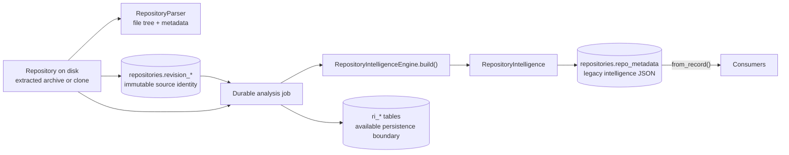

# Repository Intelligence

Repository Intelligence is PARTHA's single repository-understanding boundary. It exists so that a repository is parsed **once** and every product surface reads the same facts, instead of each feature growing its own parser and quietly disagreeing with the others.

This document describes what the engine actually does today. Read it before changing anything under `apps/backend/app/intelligence/`, and before adding any feature that needs to know something about a repository.

---

## The rule

> **Consumers must not independently parse repositories or construct a second source of repository truth.**

The AI subsystem is a consumer like any other, and gets no exemption:

> **AI is a consumer of Repository Intelligence and must not independently parse or reinterpret repositories.**

If your feature needs a repository fact that does not exist yet, the answer is always: **add reusable extraction to `app/intelligence/`, then consume it.** It is never: read the files yourself.

---

## What Repository Intelligence currently means

Production analysis now has two deliberate outputs. A durable job builds the
`RepositoryIntelligence` Pydantic model
([`app/intelligence/models.py`](../../apps/backend/app/intelligence/models.py))
through `RepositoryIntelligenceEngine`
([`app/intelligence/engine.py`](../../apps/backend/app/intelligence/engine.py))
and serializes it onto the repository row for legacy consumers. The same job
also runs the evidence-backed Python and TypeScript extractors, resolves stored
observations, and seals a normalized `ri.v1` snapshot.

The `ri.v1` persistence boundary includes first-class repository revision
columns, normalized snapshot/fact/provenance tables, deterministic canonical
hashing, and a lifecycle store that validates and seals immutable snapshots.
Evidence-backed Python and TypeScript extractors, the dependency-manifest
extractor, their support matrices, the repository-level source-policy
pipeline, deterministic
[relationship resolution](REPOSITORY_INTELLIGENCE_RESOLUTION.md) over stored
observations, and a heuristic `role-classifier` producer (file- and
symbol-level `classified_as` assertions, always `inferred`) all run in the
durable product job. The versioned, owner-scoped `/intelligence/v1/snapshots`
API reads sealed normalized snapshots only and explicitly rejects unsupported
schema versions; it never falls back to legacy metadata or a repository
working tree. The Architecture Graph and the evidence-backed authentication
explanation (`GET /analysis/{repositoryId}/architecture/authentication`, #95)
both consume that query boundary **exclusively** — modules, primary language,
entry points, frameworks, and relationships are all derived from the sealed
snapshot, with no legacy-metadata fallback for either consumer.



---

## Where parsing happens

The legacy product path reads repository source from disk in exactly two places:

1. **`RepositoryParser`** walks the extracted tree and produces `FileTreeNode[]` plus `RepositoryMeta` (languages, framework guess, entry point, counts, README/license presence).
2. **`RepositoryIntelligenceEngine`** reads individual file contents during `build()` — capped at 512 KB per file — to extract imports, exports, routes, and technology hints. Its dependency bridge selects supported manifests from the `RepositoryParser` file inventory and passes their bytes to the canonical `DependencyManifestExtractor`; it does not walk the repository or reimplement manifest parsing.

There is one further direct read that is **not** parsing: `RepositoryService.read_file` serves the explorer's file preview. It is a path-checked read for display only and feeds no analysis.

Nothing else may open a repository file. The evidence-backed extractors accept
stored bytes from their caller; they do not walk or open a repository themselves.
`ExtractionPipeline` applies normalized-path and source-size policy before
dispatching those bytes through each extractor's real `supports()` method.

### Syntax-aware extractors are a separate, real boundary

`PythonExtractor` uses Python's AST and `TypeScriptExtractor` uses tree-sitter.
Both emit normalized nodes, observations, diagnostics, and line evidence through
the `ExtractionResult` contract. Their declared support and blind spots live in
`app/extraction/support_matrix.py`. Durable analysis stores their output in a
sealed normalized snapshot; the legacy regex model remains alongside it for
consumers that have not migrated.

---

## What is currently extracted

| Field | Contents | How it is derived |
| --- | --- | --- |
| `metadata` | Parser repository metadata. | From `RepositoryParser`. |
| `discovery` | Primary language, language counts, frameworks, package managers, config/env/Docker/CI files, entry points, build systems, database technologies, cloud providers, statistics. | Filename matching, dependency-name lookup tables, and substring scans of file text. |
| `files` | Per-file: path, module, language, extension, size, role, imports, exports, API routes, symbols, technologies. | Regex over file text; role from path/filename conventions. |
| `modules` | Grouped modules with role, layer, path prefix, files, symbols, dependencies. | Files grouped by a derived `module_id`; role is the most common file role; layer is a lookup from role. |
| `symbols` | Functions, classes, interfaces, types, enums, constants, routes. | Regex per language. **Python and TypeScript/JavaScript only.** |
| `dependencies` | Logical direct dependency plus every declared version/specifier, type, ecosystem, workspace/manifest path, exact declaration span, and extractor identity. | Supported `package.json`, `requirements.txt`, and `pyproject.toml` files at accepted root or nested workspace paths. |
| `graph` | Serializable nodes and relationships. | Assembled from the above. |

### Deterministic vs. heuristic

This distinction matters, and consumers must respect it.

**Deterministic** — the same repository always yields the same answer, and the answer is a fact about the bytes on disk:

- file paths, names, extensions, sizes, and the file tree;
- file counts and folder counts;
- presence of README, license, Dockerfiles, CI workflow files, env files;
- dependency names and version specifiers **as declared in** the three supported manifests, including accepted nested workspaces;
- literal import statements and route decorator strings matched by the regexes.

**Heuristic** — an inference that can be wrong, and is wrong on projects that do not follow common conventions:

- **file role** (`service`, `route`, `model`, `repository`, …) — inferred from path segments and filename substrings. A file whose path merely contains `test` is classified as a test.
- **module grouping and layer** — derived from role and the first meaningful path segment, not from any real module system.
- **symbols** — regex matches. They will match text inside comments and strings, and will miss anything the pattern does not anticipate (decorated definitions, nested classes, arrow-function exports, non-Python/TS languages entirely).
- **frameworks, database technologies, cloud providers** — substring scans over file text. The word `redis` in a comment is enough to report Redis.
- **primary language and entry point** — parser guesses.

**Never present a heuristic output as a deterministic fact** — not in the UI, not in generated documentation, not in a review finding, and not in an AI answer.

---

## How it is persisted today

Import stores revision identity, parser metadata, and the file tree. After the
client submits analysis, the durable worker builds and stores both compatibility
intelligence and the normalized snapshot:

```text
repositories.repo_metadata["intelligence"]   -- entire model, JSON
repositories.revision_kind/value/ref          -- first-class immutable revision identity
repositories.file_tree                       -- parsed tree, JSON
ri_snapshots + ri_* fact tables               -- normalized ri.v1 persistence boundary
```

The repository API returns `revision: {kind,value,ref}` and retains `commitSha` only as a compatibility alias of `revision.value`. New imports do not stash `commitSha` inside mutable metadata. A new Git commit or changed upload hash creates a new repository record; the same source at the same immutable revision remains a duplicate.

Consumers still call `RepositoryIntelligenceEngine.from_record(record)`, which returns the legacy model if present and **rebuilds it from disk as a fallback** if it is missing or fails validation. That compatibility path is not an `ri.v1` snapshot producer: its regex facts have no valid spans or versioned provenance and are never promoted to `observed`, `resolved`, or `inferred` rows.

`SnapshotStore` fixes the complete semantic identity before a build, enforces
same-snapshot foreign keys and provenance, validates derivation chains, computes
the canonical graph hash, and seals the snapshot. Completed snapshots reject
mutation. The query API exposes sealed snapshot metadata, symbols, stored
resolved relationships, inferred assertions, file facts, and evidence spans.
Architecture and the authentication explanation both build entirely from that
owner-scoped persisted-fact query; other product consumers (dependency graph,
engineering review, documentation, AI) remain on the legacy model.

The architecture read is bounded to what the response actually renders (#133):
the relationship predicates Architecture draws, the resolution diagnostics it
displays, `classified_as` assertions, and the file, dependency and repository
nodes it inventories — plus any symbol node that is an endpoint of a rendered
relationship. Symbol nodes that no rendered edge references are not loaded, and
observations are no longer hydrated at all. Covered module paths come from a
single distinct-path read over non-inventory node or observation evidence
instead of walking every evidence row already in memory. Evidence lookups by ID
run in bounded batches. The architecture response therefore stays proportional
to the relationships and diagnostics it exposes; this is a targeted read, not
API pagination.

---

## The knowledge graph

Node types: `repository`, `module`, `file`, `symbol`, `dependency`.

Relationship types declared in the model: `contains`, `imports`, `exports`, `depends_on`, `calls`, `extends`, `implements`, `references`.

**Only the first four are ever emitted.** `calls`, `extends`, `implements`, and `references` exist in the type union, but nothing produces them. Their presence in the model is not a guarantee that the data exists — do not build a feature that assumes they are populated.

Each relationship carries an `evidence` list — which currently holds **file paths only**, not line spans.

---

## Consumers

| Consumer | Module | Reads |
| --- | --- | --- |
| Architecture | `app/analysis/architecture.py` | exclusively the sealed snapshot query layer — nodes, resolved edges, `classified_as` assertions, diagnostics, and evidence. No legacy `repo_metadata['intelligence']` read. |
| Authentication explanation (#95) | `app/analysis/authentication.py` | exclusively the sealed snapshot query layer — routes, `routes_to`/`injects`/`calls` edges, `classified_as` assertions, diagnostics. No legacy read. |
| Dependency graph | `app/graph/` | legacy engine: dependencies, `depends_on` relationships |
| Engineering review | `app/review/` | legacy engine: discovery, statistics, file roles and sizes |
| Documentation | `app/services/documentation_service.py` | legacy engine: discovery, files, routes, architecture, dependencies |
| AI | `app/ai/repository_context.py` | legacy engine: discovery, modules, dependencies, file paths |
| Reports and exports | `app/reports/` | existing analysis and documentation output |

### What consumers are forbidden from doing

- Walking the repository filesystem.
- Reading or re-reading dependency manifests.
- Re-implementing language, framework, or config detection.
- Caching their own parallel copy of repository facts.
- Letting an AI provider read repository files or call the engine directly.
- Presenting a heuristic output as a deterministic fact.

A consumer's job is to transform `RepositoryIntelligence` into a response shape. That is all.

---

## Evidence and provenance

Two terms with distinct meanings. PARTHA uses them precisely, and supports neither of them completely.

- **Evidence** — the source artifact that supports a repository fact: a file, a declaration, an import, a route, or a configuration entry.
- **Provenance** — the information identifying *where a fact came from*: the revision, file, symbol, line span, and extraction method.

### What exists today

**Evidence: partial.** Graph relationships and engineering-review findings carry the **file paths** they were derived from. That is real evidence, and it is enough to point a reader at the right file.

Environment-file review findings also name their evidence class: a committed template, a runtime environment file with no detected secret-like value, or a secret-like value. A `.env.example`, `.env.sample`, `.env.template`, or `.env.dist` filename is never treated as proof of an exposed secret. Dotenv quoting and inline comments are removed before placeholder checks. Sensitive-looking configuration keys whose names continue with metadata such as `_ENABLED`, `_REQUIRED`, `_PATH`, or `_EXPIRY_SECONDS` do not count as credential keys, and boolean, numeric, path, or ordinary URL values do not provide credible secret evidence. The review reports sensitive key names and file paths, never values; rotation advice appears only when a credential-shaped, non-placeholder value is detected. Legacy cached intelligence without content-derived environment evidence is upgraded in bounded time to non-critical runtime-file evidence instead of rebuilding the repository on every read.

For the `Oversized Source Files` review signal, PARTHA evaluates only authored source-code extensions above the configured threshold. It excludes documentation and configuration files, common dependency lockfiles, generated or minified filenames, and files under vendor, generated, dependency, or build-output directories. The finding includes each retained file's measured byte size; size is a review signal, not a diagnosis of a design issue.

**Product-consumed provenance: incomplete.** Durable analysis creates sealed
`ri.v1` snapshots, and Architecture relationships expose exact snapshot fact IDs
and line spans from them. Other product paths still consume the legacy regex
model. Specifically:

- **No line spans.** `SourceSymbol` has `id`, `name`, `kind`, `file_path`, and `exported`. It has **no start or end line**. Nothing in the model records where in a file a fact was found.
- **No extraction method on the fact.** A consumer cannot tell whether a given fact was matched deterministically or inferred heuristically. That distinction lives in this document, not in the data.
- **Revision identity is now exact at the repository boundary.** GitHub imports store a 40-character commit plus resolved ref; uploads store a `sha256:` archive identity. Legacy JSON facts still are not individually revision-addressed, while conforming snapshot rows are.

The honest summary: **durable analysis populates an immutable snapshot with exact
revision identity, spans, producer versions, and derivations, and the
Architecture Graph can serve evidence-backed relationships from it.** If no job
has completed, the graph returns `not-extracted` rather than claiming that a
module is isolated.

This is why AI answers carry no citations. The AI context builder deliberately emits an empty citation list and sends the provider **no source content and no line numbers** — fabricating `1:1` placeholder citations would misrepresent a structural answer as line-level evidence. See [`app/ai/repository_context.py`](../../apps/backend/app/ai/repository_context.py).

Describe evidence-backed output per consumer: normalized snapshot facts and the
authentication explanation have revision-, fact-, extractor-, and line-addressed
evidence, while AI and legacy compatibility consumers remain uncited.

---

## Current limitations

- **Symbols:** syntax-derived for supported Python and TS/JS constructs, with line spans but limited signatures/nesting and deliberately conservative cross-file resolution.
- **Line spans:** emitted by the Python and TypeScript extractors, stored by durable analysis, and returned unchanged from sealed snapshots.
- **Graph production and consumption:** durable jobs populate normalized immutable graph tables through syntax-aware producers. Architecture and the authentication explanation consume sealed facts exclusively; dependency graph, engineering review, documentation, and AI still read the legacy JSON blob.
- **Relationships:** four of the eight legacy-model-declared types are never emitted. An import edge resolves to a declared dependency when the name matches and otherwise creates an `external:` node — there is no real module resolution. The `ri.v1` resolver additionally emits an `injects` predicate (#95) for a FastAPI `Depends(name)` argument, resolved the same way a direct call is — through same-file definitions or explicit import bindings only, never a repository-wide same-name guess.
- **Role classification (`classified_as` assertions, #95):** a small, explicit rule set — filename/path substring matching for files, and class-name suffix matching (`Service`, `Repository`, `Controller`, `Model`, `Middleware`, `Dto`) for symbols, plus a name-pattern heuristic (`auth`, `current_user`, `token`, `verify`, …) applied only to functions that are the object of a resolved `injects` edge. Always `truth_class="inferred"`, never presented as a guaranteed fact. It does not understand base classes, decorators beyond `Depends()`, or any framework's actual dependency-injection semantics — a differently named auth guard, or one injected some other way, is simply not classified, not misclassified.
- **Authentication subgraph selection (#95):** the classifier and the resolved graph together only produce *candidate* facts; `AuthenticationExplanationService` additionally requires graph connectivity before any of them is claimed as authentication. A route is included only when its resolved `routes_to` handler has a resolved `injects` edge to a symbol explicitly classified `auth_dependency`; a service or model is included only when it lies on a resolved `calls` path from that guard (a breadth-first walk that keeps only edges on a path to a `service`/`model`-classified symbol, discarding everything else the guard happens to call). This is why an unrelated `/health` route, a generic `Depends(get_database)`, or a same-suffix `PaymentService`/`AuditModel` that the guard never calls are never claimed as authentication even though the classifier still labels them `service`/`model` for Architecture's module grouping — a name match alone is never sufficient. The response also returns `chains`: one ordered route -> handler -> guard -> (service/model) path per qualifying route, so a consumer does not have to reconstruct the flow from the flat `relationships` list.
- **Evidence navigation (#95):** each authentication citation links to the existing repository Explorer with `snapshotId`, `factId`, path, and line span. The Explorer calls the owner-scoped `GET /analysis/{repositoryId}/evidence` endpoint, which returns source only when the exact fact/span exists and the current source bytes match the SHA-256 sealed on the snapshot's file fact; otherwise it displays an explicit unavailable state. The same Monaco-based `CodePreview` is reused rather than adding a second viewer.
- **Revision identity:** first-class and immutable per imported repository revision. Snapshot history can be retained, but diff/query APIs and product re-analysis orchestration are not implemented.
- **Dependencies:** three manifest formats, no lockfiles, no transitive resolution, and no vulnerability or outdated-version scanning. The dependency API reports both assessments as explicit `not_computed` statuses; it emits no clean result or count without a scanner.
- **Dependency inventory:** only direct declarations from accepted `package.json`, `pyproject.toml`, and `requirements.txt` paths are reported. The parser inventory excludes `.git`, dependency/install directories, build output, virtual environments, caches, vendor paths, and generated paths; lockfiles are not read. Each candidate is size-checked and read with the existing 512 KiB source budget before being processed individually; oversized manifests produce `RI-LIMIT-SKIP` rather than being retained in memory. Multiple workspace declarations remain attached to one logical dependency, including conflicts rather than an arbitrarily selected version. A malformed supported manifest produces a safe `RI-SRC-MALFORMED` diagnostic in the dependency response while valid manifests continue to contribute declarations. No transitive resolution, vulnerability scanning, or outdated-version scanning is implemented.
- **Languages:** meaningful extraction covers Python and TypeScript/JavaScript. Other languages get file-tree and metadata treatment only.
- **File size cap:** files over 512 KB are read as empty during extraction, so their contents contribute nothing.
- **Build cost:** the whole repository is re-analysed from scratch in a background job; incremental analysis is not implemented.

---

## Contributing to the engine

1. Add observed syntax facts to the shared extraction contract and the relevant
   extractor; keep heuristic legacy fields in `app/intelligence/models.py`.
2. Update the published support matrix and focused extractor tests.
3. Add or update an independently authored benchmark fixture and golden manifest.
4. Consume the normalized fact only through the Repository Intelligence query
   boundary once that boundary supports it.
5. If the fact is heuristic, say so — in the model, in the API, and in the UI.

Adding a parser inside a consumer to avoid step 1 is the single change most likely to be rejected in review.
