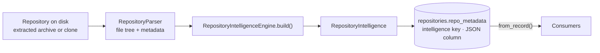

# Repository Intelligence

Repository Intelligence is PARTHA's single repository-understanding boundary. It exists so that a repository is parsed **once** and every product surface reads the same facts, instead of each feature growing its own parser and quietly disagreeing with the others.

This document describes what the engine actually does today. Read it before changing anything under `apps/backend/app/intelligence/`, and before adding any feature that needs to know something about a repository.

---

## The rule

> **Consumers must not independently parse repositories or construct a second source of repository truth.**

The AI subsystem is a consumer like any other, and gets no exemption:

> **AI is a consumer of Repository Intelligence and must not independently parse or reinterpret repositories.**

If your feature needs a repository fact that does not exist yet, the answer is always: **add reusable extraction to `app/intelligence/`, then consume it.** It is never: read the files yourself.

---

## What Repository Intelligence currently means

Concretely, it is one Pydantic model — `RepositoryIntelligence` ([`app/intelligence/models.py`](../../apps/backend/app/intelligence/models.py)) — built by one engine — `RepositoryIntelligenceEngine` ([`app/intelligence/engine.py`](../../apps/backend/app/intelligence/engine.py)) — and serialized onto the repository row.



---

## Where parsing happens

Exactly two places in the backend read repository source from disk:

1. **`RepositoryParser`** walks the extracted tree and produces `FileTreeNode[]` plus `RepositoryMeta` (languages, framework guess, entry point, counts, README/license presence).
2. **`RepositoryIntelligenceEngine`** reads individual file contents during `build()` — capped at 512 KB per file — to extract imports, exports, routes, symbols, and technology hints, and reads dependency manifests from the repository root.

There is one further direct read that is **not** parsing: `RepositoryService.read_file` serves the explorer's file preview. It is a path-checked read for display only and feeds no analysis.

Nothing else may open a repository file.

### `TreeSitterParser` is a placeholder

`app/parsers/tree_sitter_parser.py` is **not functional**. It maps a file extension to a language name and always returns an empty symbol list. `tree-sitter` is a declared dependency but is not wired into parsing. All symbol extraction today is regex-based, inside `RepositoryIntelligenceEngine`. Do not read the class name as a promise of syntax-aware parsing.

---

## What is currently extracted

| Field | Contents | How it is derived |
| --- | --- | --- |
| `metadata` | Parser repository metadata. | From `RepositoryParser`. |
| `discovery` | Primary language, language counts, frameworks, package managers, config/env/Docker/CI files, entry points, build systems, database technologies, cloud providers, statistics. | Filename matching, dependency-name lookup tables, and substring scans of file text. |
| `files` | Per-file: path, module, language, extension, size, role, imports, exports, API routes, symbols, technologies. | Regex over file text; role from path/filename conventions. |
| `modules` | Grouped modules with role, layer, path prefix, files, symbols, dependencies. | Files grouped by a derived `module_id`; role is the most common file role; layer is a lookup from role. |
| `symbols` | Functions, classes, interfaces, types, enums, constants, routes. | Regex per language. **Python and TypeScript/JavaScript only.** |
| `dependencies` | Name, version, type, ecosystem, source file. | `package.json`, `requirements.txt`, `pyproject.toml`. |
| `graph` | Serializable nodes and relationships. | Assembled from the above. |

### Deterministic vs. heuristic

This distinction matters, and consumers must respect it.

**Deterministic** — the same repository always yields the same answer, and the answer is a fact about the bytes on disk:

- file paths, names, extensions, sizes, and the file tree;
- file counts and folder counts;
- presence of README, license, Dockerfiles, CI workflow files, env files;
- dependency names and version specifiers **as declared in** the three supported manifests;
- literal import statements and route decorator strings matched by the regexes.

**Heuristic** — an inference that can be wrong, and is wrong on projects that do not follow common conventions:

- **file role** (`service`, `route`, `model`, `repository`, …) — inferred from path segments and filename substrings. A file whose path merely contains `test` is classified as a test.
- **module grouping and layer** — derived from role and the first meaningful path segment, not from any real module system.
- **symbols** — regex matches. They will match text inside comments and strings, and will miss anything the pattern does not anticipate (decorated definitions, nested classes, arrow-function exports, non-Python/TS languages entirely).
- **frameworks, database technologies, cloud providers** — substring scans over file text. The word `redis` in a comment is enough to report Redis.
- **primary language and entry point** — parser guesses.

**Never present a heuristic output as a deterministic fact** — not in the UI, not in generated documentation, not in a review finding, and not in an AI answer.

---

## How it is persisted today

At import, the engine builds `RepositoryIntelligence` and `RepositoryService` serializes it into the repository row:

```text
repositories.repo_metadata["intelligence"]   -- entire model, JSON
repositories.repo_metadata["commitSha"]      -- git HEAD SHA, or "sha256:..." of the uploaded archive
repositories.file_tree                       -- parsed tree, JSON
```

Consumers call `RepositoryIntelligenceEngine.from_record(record)`, which returns the persisted model if present and **rebuilds it from disk as a fallback** if it is missing or fails validation.

**There are no graph tables.** The knowledge graph is a JSON blob inside a metadata column. It cannot be queried, indexed, joined, or partially updated — it is read and written whole.

---

## The knowledge graph

Node types: `repository`, `module`, `file`, `symbol`, `dependency`.

Relationship types declared in the model: `contains`, `imports`, `exports`, `depends_on`, `calls`, `extends`, `implements`, `references`.

**Only the first four are ever emitted.** `calls`, `extends`, `implements`, and `references` exist in the type union, but nothing produces them. Their presence in the model is not a guarantee that the data exists — do not build a feature that assumes they are populated.

Each relationship carries an `evidence` list — which currently holds **file paths only**, not line spans.

---

## Consumers

| Consumer | Module | Reads |
| --- | --- | --- |
| Architecture | `app/analysis/` | modules, files, discovery |
| Dependency graph | `app/graph/` | dependencies, `depends_on` relationships |
| Engineering review | `app/review/` | discovery, statistics, file roles and sizes |
| Documentation | `app/services/documentation_service.py` | discovery, files, routes, architecture, dependencies |
| AI | `app/ai/repository_context.py` | discovery, modules, dependencies, file paths |
| Reports and exports | `app/reports/` | existing analysis and documentation output |

### What consumers are forbidden from doing

- Walking the repository filesystem.
- Reading or re-reading dependency manifests.
- Re-implementing language, framework, or config detection.
- Caching their own parallel copy of repository facts.
- Letting an AI provider read repository files or call the engine directly.
- Presenting a heuristic output as a deterministic fact.

A consumer's job is to transform `RepositoryIntelligence` into a response shape. That is all.

---

## Evidence and provenance

Two terms with distinct meanings. PARTHA uses them precisely, and supports neither of them completely.

- **Evidence** — the source artifact that supports a repository fact: a file, a declaration, an import, a route, or a configuration entry.
- **Provenance** — the information identifying *where a fact came from*: the revision, file, symbol, line span, and extraction method.

### What exists today

**Evidence: partial.** Graph relationships and engineering-review findings carry the **file paths** they were derived from. That is real evidence, and it is enough to point a reader at the right file.

**Provenance: incomplete.** Specifically:

- **No line spans.** `SourceSymbol` has `id`, `name`, `kind`, `file_path`, and `exported`. It has **no start or end line**. Nothing in the model records where in a file a fact was found.
- **No extraction method on the fact.** A consumer cannot tell whether a given fact was matched deterministically or inferred heuristically. That distinction lives in this document, not in the data.
- **Revision identity is coarse.** `commitSha` (the git HEAD SHA, or a `sha256:` content hash for uploads) is stored on the **repository row**, not on the `RepositoryIntelligence` model or on any individual fact. Facts are not addressed to a revision, and re-importing does not version them.

The honest summary: **PARTHA can tell you which file a fact came from. It cannot tell you which line, from which revision, or how the fact was derived.**

This is why AI answers carry no citations. The AI context builder deliberately emits an empty citation list and sends the provider **no source content and no line numbers** — fabricating `1:1` placeholder citations would misrepresent a structural answer as line-level evidence. See [`app/ai/repository_context.py`](../../apps/backend/app/ai/repository_context.py).

Do not describe PARTHA as having evidence-backed or grounded output until line spans, per-fact extraction method, and revision-addressed facts actually exist.

---

## Current limitations

- **Symbols:** regex-derived, Python and TS/JS only, no line spans, no signatures, no nesting, no cross-file resolution. Matches inside comments and strings are not excluded.
- **Line spans:** not extracted anywhere in the system.
- **Graph persistence:** a JSON blob on a metadata column. No graph tables, no queryability, no incremental update.
- **Relationships:** four of the eight declared types are never emitted. An import edge resolves to a declared dependency when the name matches and otherwise creates an `external:` node — there is no real module resolution.
- **Revision identity:** recorded per repository, not per fact. No history, no diffing, no re-analysis on change.
- **Dependencies:** three manifest formats, no lockfiles, no transitive resolution, and no vulnerability or outdated-version scanning. The dependency API reports both assessments as explicit `not_computed` statuses; it emits no clean result or count without a scanner.
- **Languages:** meaningful extraction covers Python and TypeScript/JavaScript. Other languages get file-tree and metadata treatment only.
- **File size cap:** files over 512 KB are read as empty during extraction, so their contents contribute nothing.
- **Build cost:** the whole repository is re-analysed from scratch, synchronously, inside the HTTP request.

---

## Contributing to the engine

1. Add the fact to the model in `app/intelligence/models.py`.
2. Extract it in `app/intelligence/engine.py`.
3. Cover it with a test in `apps/backend/tests/test_repository_intelligence.py`.
4. Consume it in the feature that needed it.
5. If the fact is heuristic, say so — in the model, in the API, and in the UI.

Adding a parser inside a consumer to avoid step 1 is the single change most likely to be rejected in review.
