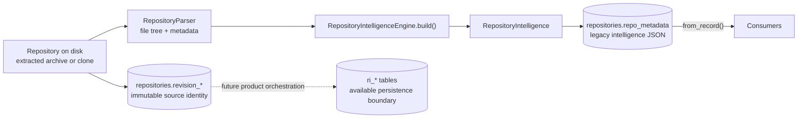

# Repository Intelligence

Repository Intelligence is PARTHA's single repository-understanding boundary. It exists so that a repository is parsed **once** and every product surface reads the same facts, instead of each feature growing its own parser and quietly disagreeing with the others.

This document describes what the engine actually does today. Read it before changing anything under `apps/backend/app/intelligence/`, and before adding any feature that needs to know something about a repository.

---

## The rule

> **Consumers must not independently parse repositories or construct a second source of repository truth.**

The AI subsystem is a consumer like any other, and gets no exemption:

> **AI is a consumer of Repository Intelligence and must not independently parse or reinterpret repositories.**

If your feature needs a repository fact that does not exist yet, the answer is always: **add reusable extraction to `app/intelligence/`, then consume it.** It is never: read the files yourself.

---

## What Repository Intelligence currently means

The production extraction path is still one Pydantic model — `RepositoryIntelligence` ([`app/intelligence/models.py`](../../apps/backend/app/intelligence/models.py)) — built by one engine — `RepositoryIntelligenceEngine` ([`app/intelligence/engine.py`](../../apps/backend/app/intelligence/engine.py)) — and serialized onto the repository row. That blob is retained as explicitly legacy/unverified compatibility data.

The `ri.v1` persistence boundary now also exists: first-class repository revision columns, normalized snapshot/fact/provenance tables, deterministic canonical hashing, and a lifecycle store that validates and seals immutable snapshots. Evidence-backed Python and TypeScript extractors, their support matrices, the repository-level source-policy pipeline, and deterministic [relationship resolution](REPOSITORY_INTELLIGENCE_RESOLUTION.md) over stored observations exist under `app/extraction` and `app/intelligence`; the Issue #94 benchmark executes and validates the extraction pipeline. The versioned, owner-scoped `/intelligence/v1/snapshots` API reads sealed `ri.v1` normalized snapshots only and explicitly rejects unsupported snapshot schema versions; it never falls back to legacy metadata or a repository working tree. Product ingestion still does not run either the legacy regex output or the new extractors through the normalized snapshot tables, and durable job orchestration and consumer migration remain separate work (#93 and #95).



---

## Where parsing happens

The legacy product path reads repository source from disk in exactly two places:

1. **`RepositoryParser`** walks the extracted tree and produces `FileTreeNode[]` plus `RepositoryMeta` (languages, framework guess, entry point, counts, README/license presence).
2. **`RepositoryIntelligenceEngine`** reads individual file contents during `build()` — capped at 512 KB per file — to extract imports, exports, routes, symbols, and technology hints, and reads dependency manifests from the repository root.

There is one further direct read that is **not** parsing: `RepositoryService.read_file` serves the explorer's file preview. It is a path-checked read for display only and feeds no analysis.

Nothing else may open a repository file. The evidence-backed extractors accept
stored bytes from their caller; they do not walk or open a repository themselves.
`ExtractionPipeline` applies normalized-path and source-size policy before
dispatching those bytes through each extractor's real `supports()` method.

### Syntax-aware extractors are a separate, real boundary

`PythonExtractor` uses Python's AST and `TypeScriptExtractor` uses tree-sitter.
Both emit normalized nodes, observations, diagnostics, and line evidence through
the `ExtractionResult` contract. Their declared support and blind spots live in
`app/extraction/support_matrix.py`. They supersede the legacy regex engine for a
future normalized-snapshot build, but product ingestion has not been switched to
that build yet.

---

## What is currently extracted

| Field | Contents | How it is derived |
| --- | --- | --- |
| `metadata` | Parser repository metadata. | From `RepositoryParser`. |
| `discovery` | Primary language, language counts, frameworks, package managers, config/env/Docker/CI files, entry points, build systems, database technologies, cloud providers, statistics. | Filename matching, dependency-name lookup tables, and substring scans of file text. |
| `files` | Per-file: path, module, language, extension, size, role, imports, exports, API routes, symbols, technologies. | Regex over file text; role from path/filename conventions. |
| `modules` | Grouped modules with role, layer, path prefix, files, symbols, dependencies. | Files grouped by a derived `module_id`; role is the most common file role; layer is a lookup from role. |
| `symbols` | Functions, classes, interfaces, types, enums, constants, routes. | Regex per language. **Python and TypeScript/JavaScript only.** |
| `dependencies` | Name, version, type, ecosystem, source file. | `package.json`, `requirements.txt`, `pyproject.toml`. |
| `graph` | Serializable nodes and relationships. | Assembled from the above. |

### Deterministic vs. heuristic

This distinction matters, and consumers must respect it.

**Deterministic** — the same repository always yields the same answer, and the answer is a fact about the bytes on disk:

- file paths, names, extensions, sizes, and the file tree;
- file counts and folder counts;
- presence of README, license, Dockerfiles, CI workflow files, env files;
- dependency names and version specifiers **as declared in** the three supported manifests;
- literal import statements and route decorator strings matched by the regexes.

**Heuristic** — an inference that can be wrong, and is wrong on projects that do not follow common conventions:

- **file role** (`service`, `route`, `model`, `repository`, …) — inferred from path segments and filename substrings. A file whose path merely contains `test` is classified as a test.
- **module grouping and layer** — derived from role and the first meaningful path segment, not from any real module system.
- **symbols** — regex matches. They will match text inside comments and strings, and will miss anything the pattern does not anticipate (decorated definitions, nested classes, arrow-function exports, non-Python/TS languages entirely).
- **frameworks, database technologies, cloud providers** — substring scans over file text. The word `redis` in a comment is enough to report Redis.
- **primary language and entry point** — parser guesses.

**Never present a heuristic output as a deterministic fact** — not in the UI, not in generated documentation, not in a review finding, and not in an AI answer.

---

## How it is persisted today

At import, the engine builds `RepositoryIntelligence` and `RepositoryService` serializes it into the repository row:

```text
repositories.repo_metadata["intelligence"]   -- entire model, JSON
repositories.revision_kind/value/ref          -- first-class immutable revision identity
repositories.file_tree                       -- parsed tree, JSON
ri_snapshots + ri_* fact tables               -- normalized ri.v1 persistence boundary
```

The repository API returns `revision: {kind,value,ref}` and retains `commitSha` only as a compatibility alias of `revision.value`. New imports do not stash `commitSha` inside mutable metadata. A new Git commit or changed upload hash creates a new repository record; the same source at the same immutable revision remains a duplicate.

Consumers still call `RepositoryIntelligenceEngine.from_record(record)`, which returns the legacy model if present and **rebuilds it from disk as a fallback** if it is missing or fails validation. That compatibility path is not an `ri.v1` snapshot producer: its regex facts have no valid spans or versioned provenance and are never promoted to `observed`, `resolved`, or `inferred` rows.

The normalized `ri_*` tables are ready for conforming producers. `SnapshotStore` fixes the complete semantic identity before a build, enforces same-snapshot foreign keys and provenance, validates derivation chains, computes the canonical graph hash, and seals the snapshot atomically. Completed snapshots reject mutation. The query API exposes sealed snapshot metadata, symbols, stored resolved relationships, inferred assertions, file facts, and evidence spans; product consumers have not yet migrated to it.

---

## The knowledge graph

Node types: `repository`, `module`, `file`, `symbol`, `dependency`.

Relationship types declared in the model: `contains`, `imports`, `exports`, `depends_on`, `calls`, `extends`, `implements`, `references`.

**Only the first four are ever emitted.** `calls`, `extends`, `implements`, and `references` exist in the type union, but nothing produces them. Their presence in the model is not a guarantee that the data exists — do not build a feature that assumes they are populated.

Each relationship carries an `evidence` list — which currently holds **file paths only**, not line spans.

---

## Consumers

| Consumer | Module | Reads |
| --- | --- | --- |
| Architecture | `app/analysis/` | modules, files, discovery |
| Dependency graph | `app/graph/` | dependencies, `depends_on` relationships |
| Engineering review | `app/review/` | discovery, statistics, file roles and sizes |
| Documentation | `app/services/documentation_service.py` | discovery, files, routes, architecture, dependencies |
| AI | `app/ai/repository_context.py` | discovery, modules, dependencies, file paths |
| Reports and exports | `app/reports/` | existing analysis and documentation output |

### What consumers are forbidden from doing

- Walking the repository filesystem.
- Reading or re-reading dependency manifests.
- Re-implementing language, framework, or config detection.
- Caching their own parallel copy of repository facts.
- Letting an AI provider read repository files or call the engine directly.
- Presenting a heuristic output as a deterministic fact.

A consumer's job is to transform `RepositoryIntelligence` into a response shape. That is all.

---

## Evidence and provenance

Two terms with distinct meanings. PARTHA uses them precisely, and supports neither of them completely.

- **Evidence** — the source artifact that supports a repository fact: a file, a declaration, an import, a route, or a configuration entry.
- **Provenance** — the information identifying *where a fact came from*: the revision, file, symbol, line span, and extraction method.

### What exists today

**Evidence: partial.** Graph relationships and engineering-review findings carry the **file paths** they were derived from. That is real evidence, and it is enough to point a reader at the right file.

Environment-file review findings also name their evidence class: a committed template, a runtime environment file with no detected secret-like value, or a secret-like value. A `.env.example`, `.env.sample`, `.env.template`, or `.env.dist` filename is never treated as proof of an exposed secret. Dotenv quoting and inline comments are removed before placeholder checks. Sensitive-looking configuration keys whose names continue with metadata such as `_ENABLED`, `_REQUIRED`, `_PATH`, or `_EXPIRY_SECONDS` do not count as credential keys, and boolean, numeric, path, or ordinary URL values do not provide credible secret evidence. The review reports sensitive key names and file paths, never values; rotation advice appears only when a credential-shaped, non-placeholder value is detected. Legacy cached intelligence without content-derived environment evidence is upgraded in bounded time to non-critical runtime-file evidence instead of rebuilding the repository on every read.

**Product-consumed provenance: incomplete.** The new persistence schema can store complete `ri.v1` provenance and the standalone extractors can produce it, but the current product path still consumes the legacy regex engine. Specifically:

- **No line spans.** `SourceSymbol` has `id`, `name`, `kind`, `file_path`, and `exported`. It has **no start or end line**. Nothing in the model records where in a file a fact was found.
- **No extraction method on the fact.** A consumer cannot tell whether a given fact was matched deterministically or inferred heuristically. That distinction lives in this document, not in the data.
- **Revision identity is now exact at the repository boundary.** GitHub imports store a 40-character commit plus resolved ref; uploads store a `sha256:` archive identity. Legacy JSON facts still are not individually revision-addressed, while conforming snapshot rows are.

The honest summary: **the persistence layer can retain exact revisions, spans, producer versions, and derivations, and the extractor boundary emits conforming spans; today's product consumers still receive only the legacy file-level facts.** No line-cited product claim exists until the durable snapshot workflow populates and serves conforming snapshots.

This is why AI answers carry no citations. The AI context builder deliberately emits an empty citation list and sends the provider **no source content and no line numbers** — fabricating `1:1` placeholder citations would misrepresent a structural answer as line-level evidence. See [`app/ai/repository_context.py`](../../apps/backend/app/ai/repository_context.py).

Do not describe PARTHA as having evidence-backed or grounded output until line spans, per-fact extraction method, and revision-addressed facts actually exist.

---

## Current limitations

- **Symbols:** regex-derived, Python and TS/JS only, no line spans, no signatures, no nesting, no cross-file resolution. Matches inside comments and strings are not excluded.
- **Line spans:** emitted by the Python and TypeScript extractors and returned unchanged when a sealed snapshot exists, but product ingestion does not yet create those snapshots.
- **Graph production and consumption:** normalized immutable graph tables, syntax-aware producers, and a sealed-snapshot query API exist, but no durable product job populates them and product surfaces still read the legacy JSON blob.
- **Relationships:** four of the eight declared types are never emitted. An import edge resolves to a declared dependency when the name matches and otherwise creates an `external:` node — there is no real module resolution.
- **Revision identity:** first-class and immutable per imported repository revision. Snapshot history can be retained, but diff/query APIs and product re-analysis orchestration are not implemented.
- **Dependencies:** three manifest formats, no lockfiles, no transitive resolution, and no vulnerability or outdated-version scanning. The dependency API reports both assessments as explicit `not_computed` statuses; it emits no clean result or count without a scanner.
- **Languages:** meaningful extraction covers Python and TypeScript/JavaScript. Other languages get file-tree and metadata treatment only.
- **File size cap:** files over 512 KB are read as empty during extraction, so their contents contribute nothing.
- **Build cost:** the whole repository is re-analysed from scratch, synchronously, inside the HTTP request.

---

## Contributing to the engine

1. Add observed syntax facts to the shared extraction contract and the relevant
   extractor; keep heuristic legacy fields in `app/intelligence/models.py`.
2. Update the published support matrix and focused extractor tests.
3. Add or update an independently authored benchmark fixture and golden manifest.
4. Consume the normalized fact only through the Repository Intelligence query
   boundary once that boundary supports it.
5. If the fact is heuristic, say so — in the model, in the API, and in the UI.

Adding a parser inside a consumer to avoid step 1 is the single change most likely to be rejected in review.
