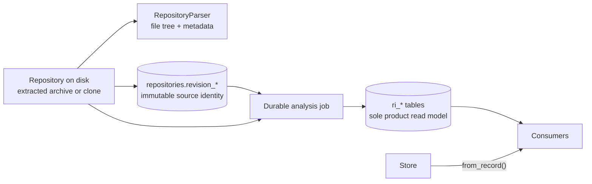

# Repository Intelligence

Repository Intelligence is PARTHA's single repository-understanding boundary. It exists so that a repository is parsed **once** and every product surface reads the same facts, instead of each feature growing its own parser and quietly disagreeing with the others.

This document describes what the engine actually does today. Read it before changing anything under `apps/backend/app/intelligence/`, and before adding any feature that needs to know something about a repository.

---

## The rule

> **Consumers must not independently parse repositories or construct a second source of repository truth.**

The AI subsystem is a consumer like any other, and gets no exemption:

> **AI is a consumer of Repository Intelligence and must not independently parse or reinterpret repositories.**

If your feature needs a repository fact that does not exist yet, the answer is always: **add reusable extraction to `app/intelligence/`, then consume it.** It is never: read the files yourself.

---

## What Repository Intelligence currently means

Production analysis has one authoritative output. A durable job runs the
evidence-backed Python, TypeScript, and dependency-manifest extractors, resolves
stored observations, classifies explicitly heuristic roles, and seals a
normalized `ri.v1` snapshot. It no longer builds or writes the legacy mutable
`RepositoryIntelligence` JSON model.

The `ri.v1` persistence boundary includes first-class repository revision
columns, normalized snapshot/fact/provenance tables, deterministic canonical
hashing, and a lifecycle store that validates and seals immutable snapshots.
Evidence-backed Python and TypeScript extractors, the dependency-manifest
extractor, their support matrices, the repository-level source-policy
pipeline, deterministic
[relationship resolution](REPOSITORY_INTELLIGENCE_RESOLUTION.md) over stored
observations, and a heuristic `role-classifier` producer (file- and
symbol-level `classified_as` assertions, always `inferred`) all run in the
durable product job. The versioned, owner-scoped `/intelligence/v1/snapshots`
API reads sealed normalized snapshots only and explicitly rejects unsupported
schema versions; it never falls back to legacy metadata or a repository
working tree. The Architecture Graph and the evidence-backed authentication
explanation (`GET /analysis/{repositoryId}/architecture/authentication`, #95)
both consume that query boundary **exclusively** — modules, primary language,
entry points, frameworks, and relationships are all derived from the sealed
snapshot, with no legacy-metadata fallback for either consumer.



---

## Where parsing happens

Repository source enters the intelligence pipeline in two bounded phases:

1. **`RepositoryParser`** walks the extracted tree during import and persists a path inventory plus basic import metadata.
2. **`AnalysisWorker`** reads the persisted inventory's source paths under the shared size/path policy and supplies bytes to `ExtractionPipeline`. The Python, TypeScript, and dependency-manifest extractors never walk the tree themselves.

There is one further direct read that is **not** parsing: `RepositoryService.read_file` serves the explorer's file preview. It is a path-checked read for display only and feeds no analysis.

Nothing else may open a repository file. The evidence-backed extractors accept
stored bytes from their caller; they do not walk or open a repository themselves.
`ExtractionPipeline` applies normalized-path and source-size policy before
dispatching those bytes through each extractor's real `supports()` method.

### Syntax-aware extractors are a separate, real boundary

`PythonExtractor` uses Python's AST and `TypeScriptExtractor` uses tree-sitter.
Both emit normalized nodes, observations, diagnostics, and line evidence through
the `ExtractionResult` contract. Their declared support and blind spots live in
`app/extraction/support_matrix.py`. Durable analysis stores their output in a
sealed normalized snapshot. Historical legacy JSON is not produced or consumed.

---

## What is currently extracted

| Field | Contents | How it is derived |
| --- | --- | --- |
| `file` nodes | Observed normalized paths, supported language, content hash. | Repository inventory producer. |
| `symbol` and `module` nodes | Supported Python and TypeScript/JavaScript syntax facts. | AST/tree-sitter extractors with stored evidence spans. |
| `classified_as` assertions | File and symbol roles. | Explicit path/name heuristics, stored as inferred with heuristic confidence. |
| `dependency` nodes | Logical direct dependency plus every declared version/specifier, type, ecosystem, workspace/manifest path, exact declaration span, and extractor identity. | Supported `package.json`, `requirements.txt`, and `pyproject.toml` files at accepted root or nested workspace paths. |
| observations and resolved edges | Imports, calls, routes, dependency declarations, and supported relationships. | Syntax/manifest observations resolved only against stored snapshot facts. |
| diagnostics and evidence | Unsupported/malformed/unresolved states plus exact stored spans where available. | Producers and resolver; missing facts are never manufactured. |

### Deterministic vs. heuristic

This distinction matters, and consumers must respect it.

**Deterministic** — the same repository always yields the same answer, and the answer is a fact about the bytes on disk:

- file paths, names, extensions, sizes, and the file tree;
- supported Python and TypeScript/JavaScript modules, symbols, imports, calls,
  route declarations, and implementation relationships, with source spans;
- dependency names and version specifiers **as declared in** the three supported manifests, including accepted nested workspaces;
- resolved graph edges and unresolved/ambiguous diagnostics produced from stored
  observations under the published resolution rules;
- primary language and recognized framework labels derived from observed file
  languages and declared direct dependencies.

**Heuristic** — an inference that can be wrong, and is wrong on projects that do not follow common conventions:

- **file and symbol role** (`service`, `route`, `model`, `repository`, …) —
  inferred from explicit path/name rules and stored as `classified_as`
  assertions with `truth_class="inferred"`;
- **module grouping and architectural layer** — presentation projections derived
  from those inferred roles and path segments;
- **entry points and architecture pattern labels** — projections over inferred
  roles and a bounded framework mapping, not universal semantic conclusions.

**Never present a heuristic output as a deterministic fact** — not in the UI, not in generated documentation, not in a review finding, and not in an AI answer.

---

## How it is persisted today

Import stores revision identity, parser metadata, and the file tree. After the
client submits analysis, the durable worker builds and stores the normalized
snapshot:

```text
repositories.revision_kind/value/ref          -- first-class immutable revision identity
repositories.file_tree                       -- parsed tree, JSON
ri_snapshots + ri_* fact tables               -- normalized ri.v1 persistence boundary
```

The repository API returns `revision: {kind,value,ref}` and retains `commitSha` only as a compatibility alias of `revision.value`. New imports do not stash `commitSha` inside mutable metadata. A new Git commit or changed upload hash creates a new repository record; the same source at the same immutable revision remains a duplicate.

Historical `repo_metadata["intelligence"]` values may remain in existing rows,
but executable product code ignores them. There is no destructive rewrite and
no filesystem or legacy-engine fallback.

`SnapshotStore` fixes the complete semantic identity before a build, enforces
same-snapshot foreign keys and provenance, validates derivation chains, computes
the canonical graph hash, and seals the snapshot. Completed snapshots reject
mutation. The query API exposes sealed snapshot metadata, symbols, stored
resolved relationships, inferred assertions, file facts, and evidence spans.
Architecture, the authentication explanation, Engineering Review, Insights, and
Dependency Graph (#158) build entirely from owner-scoped persisted-fact
queries. Documentation and free-form AI context share a bounded immutable
projection over the owner-scoped sealed snapshot for the repository's current
revision. Missing or stale snapshots return the standard 404.

The architecture read is bounded to what the response actually renders (#133):
the relationship predicates Architecture draws, the resolution diagnostics it
displays, `classified_as` assertions, and the file, dependency and repository
nodes it inventories — plus any symbol node that is an endpoint of a rendered
relationship. Symbol nodes that no rendered edge references are not loaded, and
observations are no longer hydrated at all. Covered module paths come from a
single distinct-path read over non-inventory node or observation evidence
instead of walking every evidence row already in memory. Evidence lookups by ID
run in bounded batches. The architecture response therefore stays proportional
to the relationships and diagnostics it exposes; this is a targeted read, not
API pagination.

---

## The knowledge graph

Node kinds currently persisted are `repository`, `module`, `file`, `symbol`,
and `dependency`.

The resolver can emit `contains`, `defines`, `imports`, `calls`, `implements`,
`routes_to`, `depends_on`, and `injects`. A consumer must request only the
predicates it needs through the snapshot query layer; the Architecture response,
for example, intentionally renders a bounded subset.

Edges are backed by snapshot evidence records carrying normalized paths and
inclusive line spans where the producer can provide them. Unresolved or
ambiguous observations remain diagnostics instead of being converted into
speculative edges.

---

## Consumers

| Consumer | Module | Reads |
| --- | --- | --- |
| Architecture | `app/analysis/architecture.py` | exclusively the sealed snapshot query layer — nodes, resolved edges, `classified_as` assertions, diagnostics, and evidence. No legacy `repo_metadata['intelligence']` read. |
| Authentication explanation (#95) | `app/analysis/authentication.py` | exclusively the sealed snapshot query layer — routes, `routes_to`/`injects`/`calls` edges, `classified_as` assertions, diagnostics. No legacy read. |
| Engineering review | `app/review/` | exclusively one sealed snapshot — diagnostics promoted only when an exact same-snapshot fact and evidence span exist; manifest identity; no legacy read and no scores. |
| Repository insights | `app/insights/` | exclusively one sealed snapshot — defined node, relationship, evidence, diagnostic, language, coverage, and extractor counts; no legacy read. |
| Dependency graph (#158) | `app/graph/` | exclusively one sealed snapshot — `dependency` nodes and resolved `depends_on` edges, with declarations merged across manifests (#156); no legacy read. |
| Documentation | `app/services/documentation_service.py` | current-revision sealed projection: observed paths/languages, heuristic roles/modules, routes, dependencies/declarations, diagnostics, and snapshot identity |
| AI | `app/ai/repository_context.py` | the same sealed projection; structural facts only, with no source-file contents or fabricated citations |
| Reports and exports | `app/reports/` | snapshot-backed analysis and Documentation output |

### What consumers are forbidden from doing

- Walking the repository filesystem.
- Reading or re-reading dependency manifests.
- Re-implementing language, framework, or config detection.
- Caching their own parallel copy of repository facts.
- Letting an AI provider read repository files or call the engine directly.
- Presenting a heuristic output as a deterministic fact.

A consumer's job is to transform an owner-scoped sealed-snapshot query or its
bounded projection into a response shape. That is all.

---

## Evidence and provenance

Two terms with distinct meanings. PARTHA uses them precisely:

- **Evidence** — the source artifact that supports a repository fact: a file, a declaration, an import, a route, or a configuration entry.
- **Provenance** — the information identifying *where a fact came from*: the revision, file, symbol, line span, and extraction method.

### What exists today

Snapshot facts carry exact revision,
extractor, fact, path, and inclusive line-span identity. Architecture renders
those relationships. Authentication and Engineering Review citations open
through the owner-scoped evidence endpoint, which verifies the exact fact/span
and current source bytes against the sealed file fact. Review diagnostics
without that support are counted as omitted and never presented as findings.
Insights counts stored rows and never turns absence into a positive claim.

Every product path now consumes the sealed model. GitHub imports store a
40-character commit plus resolved ref; uploads store a `sha256:` archive
identity. Consumers require that exact current revision and never select an
arbitrary older "latest" snapshot.

The honest summary: **durable analysis populates an immutable snapshot with exact
revision identity, spans, producer versions, and derivations. Architecture,
authentication, Review, Insights, Documentation, exports, and free-form AI
context use it.** If no matching job has completed, surfaces return an honest
404/unavailable state rather than falling back to legacy facts.

This is why AI answers carry no citations. The AI context builder deliberately emits an empty citation list and sends the provider **no source content and no line numbers** — fabricating `1:1` placeholder citations would misrepresent a structural answer as line-level evidence. See [`app/ai/repository_context.py`](../../apps/backend/app/ai/repository_context.py).

Normalized snapshot facts, authentication explanations, and Review findings
have revision-, fact-, extractor-, and line-addressed evidence. Insights metrics
carry snapshot identity and exact definitions. Free-form AI remains uncited
because provider prose cannot be deterministically mapped to stored facts.

---

## Current limitations

- **Symbols:** syntax-derived for supported Python and TS/JS constructs, with line spans but limited signatures/nesting and deliberately conservative cross-file resolution.
- **Line spans:** emitted by the Python and TypeScript extractors, stored by durable analysis, and returned unchanged from sealed snapshots.
- **Graph production and consumption:** durable jobs populate normalized immutable graph tables through syntax-aware producers. Every product surface consumes sealed facts exclusively. Documentation and free-form AI use a bounded structural projection and do not receive source contents.
- **Relationships:** resolution is deliberately conservative. An import edge
  resolves to a local module or declared dependency when supported; otherwise
  the observation remains unresolved and no external placeholder is invented.
  `calls`, `implements`, `routes_to`, and
  `injects` are limited to the syntax and binding rules in
  [the resolution contract](REPOSITORY_INTELLIGENCE_RESOLUTION.md). A FastAPI
  `Depends(name)` argument resolves through same-file definitions or explicit
  import bindings only, never a repository-wide same-name guess.
- **Role classification (`classified_as` assertions, #95):** a small, explicit rule set — filename/path substring matching for files, and class-name suffix matching (`Service`, `Repository`, `Controller`, `Model`, `Middleware`, `Dto`) for symbols, plus a name-pattern heuristic (`auth`, `current_user`, `token`, `verify`, …) applied only to functions that are the object of a resolved `injects` edge. Always `truth_class="inferred"`, never presented as a guaranteed fact. It does not understand base classes, decorators beyond `Depends()`, or any framework's actual dependency-injection semantics — a differently named auth guard, or one injected some other way, is simply not classified, not misclassified.
- **Authentication subgraph selection (#95):** the classifier and the resolved graph together only produce *candidate* facts; `AuthenticationExplanationService` additionally requires graph connectivity before any of them is claimed as authentication. A route is included only when its resolved `routes_to` handler has a resolved `injects` edge to a symbol explicitly classified `auth_dependency`; a service or model is included only when it lies on a resolved `calls` path from that guard (a breadth-first walk that keeps only edges on a path to a `service`/`model`-classified symbol, discarding everything else the guard happens to call). This is why an unrelated `/health` route, a generic `Depends(get_database)`, or a same-suffix `PaymentService`/`AuditModel` that the guard never calls are never claimed as authentication even though the classifier still labels them `service`/`model` for Architecture's module grouping — a name match alone is never sufficient. The response also returns `chains`: one ordered route -> handler -> guard -> (service/model) path per qualifying route, so a consumer does not have to reconstruct the flow from the flat `relationships` list.
- **Evidence navigation (#95, #154):** authentication and Engineering Review citations link to the existing repository Explorer with `snapshotId`, `factId`, path, and line span. The Explorer calls the owner-scoped `GET /analysis/{repositoryId}/evidence` endpoint, which returns source only when the exact fact/span exists and the current source bytes match the SHA-256 sealed on the snapshot's file fact; otherwise it displays an explicit unavailable state. The same Monaco-based `CodePreview` is reused rather than adding a second viewer.
- **Revision identity:** first-class and immutable per imported repository revision. Snapshot history can be retained, but diff/query APIs and product re-analysis orchestration are not implemented.
- **Dependencies:** three manifest formats, no lockfiles, no transitive resolution, and no vulnerability or outdated-version scanning. The dependency API reports both assessments as explicit `not_computed` statuses; it emits no clean result or count without a scanner.
- **Dependency inventory:** only direct declarations from accepted `package.json`, `pyproject.toml`, and `requirements.txt` paths are reported. The parser inventory excludes `.git`, dependency/install directories, build output, virtual environments, caches, vendor paths, and generated paths; lockfiles are not read. Each candidate is size-checked and read with the existing 512 KiB source budget before being processed individually; oversized manifests produce `RI-LIMIT-SKIP` rather than being retained in memory. Multiple workspace declarations remain attached to one logical dependency, including conflicts rather than an arbitrarily selected version. A malformed supported manifest produces a safe `RI-SRC-MALFORMED` diagnostic while valid manifests continue to contribute declarations. No transitive resolution, vulnerability scanning, or outdated-version scanning is implemented. `AnalysisWorker` merges same-producer dependency nodes that share a stable key into one node with a `declarations` list before persistence, specifically so a package declared in more than one manifest — an ordinary monorepo shape — does not fail sealing for the whole repository.
- **Languages:** meaningful extraction covers Python and TypeScript/JavaScript. Other languages get file-tree and metadata treatment only.
- **File size cap:** files over 512 KB are read as empty during extraction, so their contents contribute nothing.
- **Build cost:** the whole repository is re-analysed from scratch in a background job; incremental analysis is not implemented.

---

## Contributing to the engine

1. Add observed syntax facts to the shared extraction contract and the relevant
   extractor; represent heuristic conclusions as explicit inferred assertions.
2. Update the published support matrix and focused extractor tests.
3. Add or update an independently authored benchmark fixture and golden manifest.
4. Consume the normalized fact only through the Repository Intelligence query
   boundary once that boundary supports it.
5. If the fact is heuristic, say so — in the model, in the API, and in the UI.

Adding a parser inside a consumer to avoid step 1 is the single change most likely to be rejected in review.
