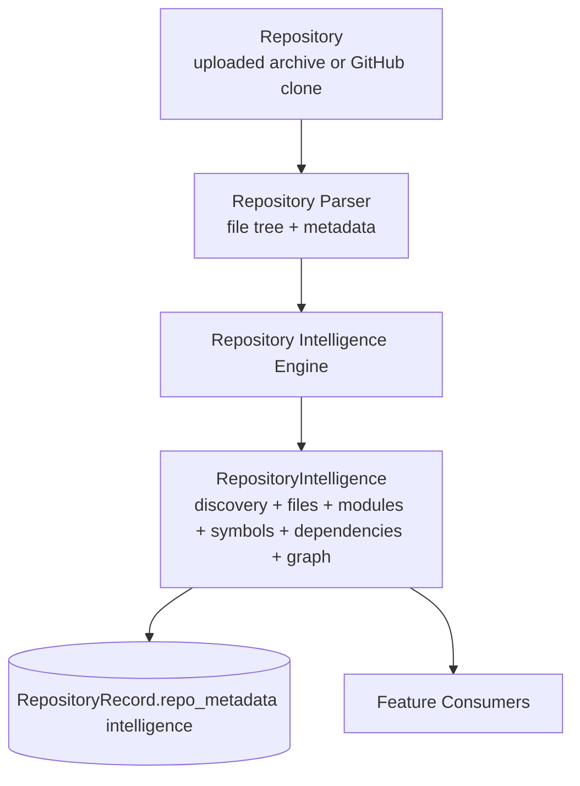
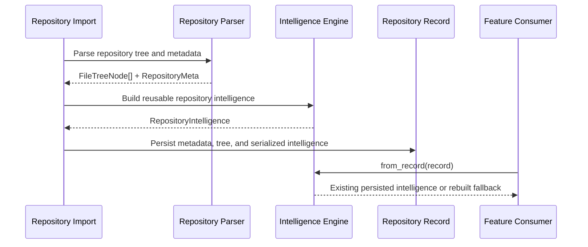
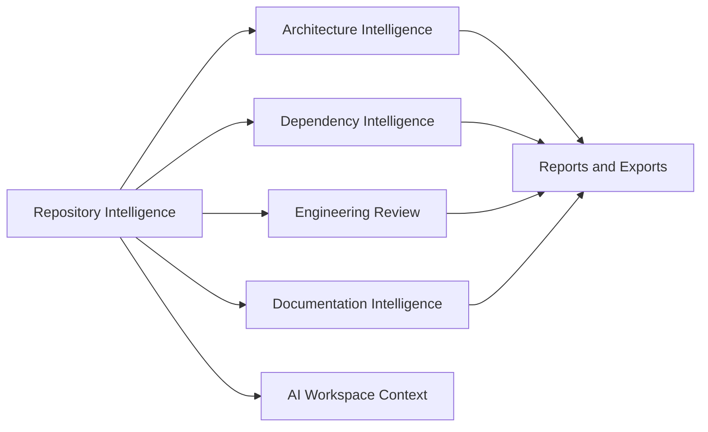

# Repository Intelligence Engine

The Repository Intelligence Engine is PARTHA's central backend subsystem for repository understanding.

It exists so every downstream feature consumes the same repository facts instead of independently parsing files.

## Architecture



## Boundaries

| Layer | Responsibility | Should not do |
| --- | --- | --- |
| Repository Parser | Walk filesystem, build file tree, produce basic metadata. | Generate feature-specific architecture/review/docs output. |
| Repository Intelligence Engine | Extract reusable repository facts, source intelligence, dependencies, modules, and graph relationships. | Render UI-specific responses. |
| Knowledge Graph | Store serializable nodes and relationships. | Re-read repository files. |
| Feature Consumers | Transform intelligence into API response shapes. | Traverse repositories or duplicate parsing heuristics. |

## Data Lifecycle



## Engine Output

`RepositoryIntelligence` contains:

| Field | Purpose |
| --- | --- |
| `metadata` | Parser-provided repository metadata. |
| `discovery` | Languages, frameworks, package managers, config, env, Docker, CI, build systems, databases, cloud providers, statistics. |
| `files` | Source file intelligence including role, imports, exports, symbols, routes, technologies. |
| `modules` | Grouped repository modules with role, layer, files, symbols, dependencies. |
| `symbols` | Functions, classes, interfaces, types, enums, constants, and routes. |
| `dependencies` | Dependency manifest entries across supported ecosystems. |
| `graph` | Serializable knowledge graph nodes and relationships. |

## Knowledge Graph

The graph currently supports these node types:

- `repository`
- `module`
- `file`
- `symbol`
- `dependency`

The graph currently supports these relationship types:

- `contains`
- `imports`
- `depends_on`
- `exports`
- `references`
- `calls`
- `extends`
- `implements`

Not every relationship type is deeply extracted yet. The model includes them so language-specific parsers can add them without changing downstream consumers.

## Consumer Flow



## Persistence

Repository intelligence is serialized into:

```text
RepositoryRecord.repo_metadata["intelligence"]
```

This avoids a database migration while establishing a durable persisted artifact. A future migration may promote this to a dedicated JSON column or graph-backed store.

## Consumers

| Consumer | Uses |
| --- | --- |
| Architecture | Modules, layers, discovery, graph relationships. |
| Dependency Graph | Dependencies and `depends_on` relationships. |
| Engineering Review | Discovery, file roles, statistics, environment/CI facts. |
| Documentation | Discovery, file list, API routes, deployment/environment facts. |
| AI Workspace | Modules, dependencies, discovery, files, selected-file context. |
| Repository Explorer | Existing parsed tree today; richer file intelligence later. |
| Insights | Future consumer. |

## Contributor Rules

- Do not add feature-specific repository traversal.
- Do not re-read dependency manifests in consumers.
- Do not duplicate language/framework/config detection outside the engine.
- Add reusable extraction to `app/intelligence` first.
- Consumers should transform `RepositoryIntelligence` into response schemas only.

## Current Limits

- Relationship extraction is intentionally lightweight.
- Graph data is serialized inside repository metadata rather than promoted to dedicated graph tables.
- Vulnerability, outdated dependency, ownership, and deep change-impact analysis are not implemented yet.
- Some language-specific extraction still relies on heuristics and parser fallbacks.
