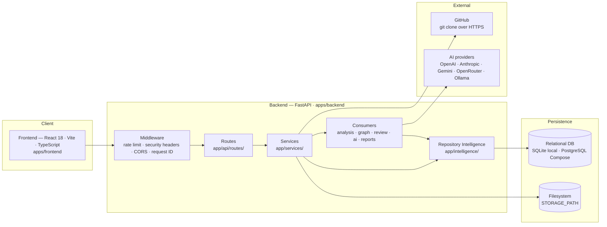
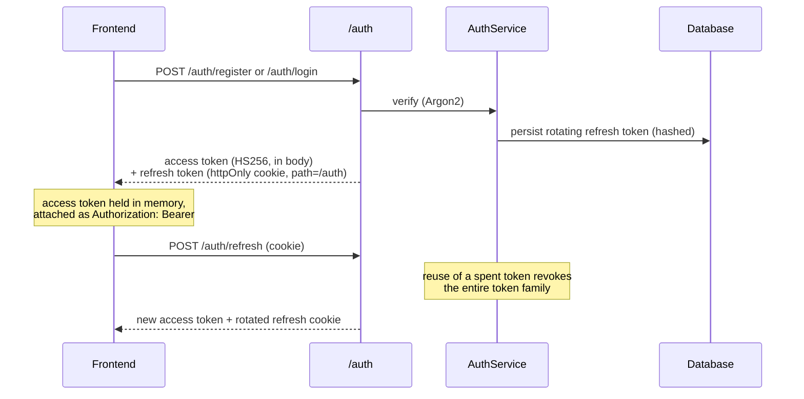
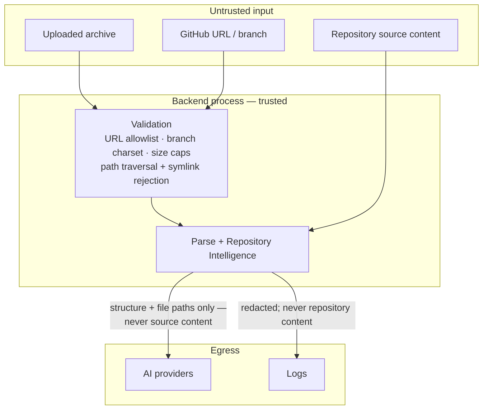

# System Overview

This document describes the system **as it exists today**. Where something is a placeholder, a constant, or a known gap, it says so. Nothing here is aspirational.

Audience: contributors and maintainers who need to know what runs, where the boundaries are, and what they must not break.

---

## Shape of the system

PARTHA is a monorepo: a React frontend, a FastAPI backend, and a local filesystem plus relational database for persistence. There is no message queue, no background worker, and no external analysis service.



---

## Components and responsibilities

### Frontend (`apps/frontend`)

| Area | Responsibility |
| --- | --- |
| `src/app/` | Shell, router, pages, and global stores. Every application route sits behind the `RequireAuth` guard; only `/login` and `/register` are public. |
| `src/features/` | Domain features with colocated hooks, components, and stores: repositories, upload, explorer, architecture, dependencies, review, documentation, AI workspace, insights, auth, settings. |
| `src/shared/` | API clients, error mapping, feature-state helpers, reusable UI, config, and types. All backend calls go through the shared client, which owns access-token attachment and 401 handling. |

### Backend (`apps/backend/app`)

| Module | Responsibility | Must not do |
| --- | --- | --- |
| `api/` | HTTP boundary. Routes stay thin; `deps.py` wires every dependency. | Contain business logic. |
| `services/` | Application services: repository import, analysis orchestration, documentation, AI. | Parse repository files directly. |
| `intelligence/` | **The Repository Intelligence engine.** Builds, persists, and reloads reusable repository facts. | Render API response shapes. |
| `parsers/` | `RepositoryParser` walks the extracted tree and produces the file tree plus basic metadata. `TreeSitterParser` is a **placeholder** — it maps extensions to language names and always returns zero symbols. | Produce feature-specific output. |
| `analysis/` | Architecture model — modules, layers, edges, request-flow hints. **Consumer.** | Read the filesystem. |
| `graph/` | Dependency graph response model. **Consumer.** | Re-read dependency manifests. |
| `review/` | Engineering review findings, scores, roadmap. **Consumer.** | Re-read the filesystem. |
| `ai/` | Context builder, prompt builder, orchestrator, provider registry/factory, and five provider implementations. **Consumer.** | Parse repositories or read source files. |
| `reports/` | `ReportDocument` intermediate representation, builders, and JSON/Markdown/HTML/PDF renderers. **Second-order consumer** — renders analysis output that already exists. | Re-analyse a repository. |
| `auth/` | Argon2 password hashing, HS256 access tokens, rotating refresh tokens with reuse detection. | — |
| `core/` | Settings and validation, database engine, structured logging with redaction, request IDs, metrics, rate limiting, security headers. | — |
| `storage/` | Local filesystem storage for uploads and extracted/cloned repositories. Enforces path safety on extraction. | — |
| `workers/` | **Empty placeholder package.** No background jobs exist. | — |

---

## Ingestion flow

Both entry points converge on the same path: land the source on disk, parse it, build Repository Intelligence, persist everything on one row.

```mermaid
sequenceDiagram
    participant UI as Frontend
    participant API as FastAPI route
    participant Repo as RepositoryService
    participant Store as LocalStorage
    participant Parser as RepositoryParser
    participant RI as RepositoryIntelligenceEngine
    participant DB as Database

    UI->>API: POST /repositories/upload (archive)<br/>or POST /repositories/github (URL)
    API->>Repo: import
    Repo->>Store: save + extract archive, or shallow-clone
    Note over Store: path traversal and symlink escape rejected;<br/>upload and clone size caps enforced
    Store-->>Repo: repository root on disk
    Repo->>Parser: parse(root)
    Parser-->>Repo: FileTreeNode[] + RepositoryMeta + size
    Repo->>RI: build(...)
    RI-->>Repo: RepositoryIntelligence
    Repo->>DB: insert row (metadata + file_tree + serialized intelligence + commitSha)
    DB-->>UI: RepositoryResponse
```

This runs **synchronously inside the HTTP request**. A large repository blocks a worker for the whole clone-parse-analyse duration. There is no job queue and no progress streaming; the `analysisStage` and `analysisProgress` fields on the row are set at fixed points, not driven by a real background pipeline.

`POST /analysis/{id}/start` then re-runs the consumers (architecture, dependencies, review) and marks the row complete — also synchronously.

---

## Persistence boundaries

| Store | Holds | Notes |
| --- | --- | --- |
| Relational DB | `users`, `refresh_tokens`, `repositories` | SQLite by default for local development; PostgreSQL under Docker Compose. Three Alembic migrations. |
| `repositories.repo_metadata` (JSON column) | Parser metadata, `commitSha`, and the **entire serialized Repository Intelligence** under the `intelligence` key. | There are **no graph tables**. The knowledge graph is a JSON blob on this column. |
| `repositories.file_tree` (JSON column) | The parsed file tree. | Serves the explorer. |
| Filesystem (`STORAGE_PATH`) | Extracted archives and cloned repositories; uploaded archives (deleted after extraction); `ai-provider.json`. | Repository source is read from here on demand for file preview. |

`ai-provider.json` is a **single global file** (mode `0600`), not per-user. Whichever provider config was saved last is the one every user's queries run against.

---

## Authentication and session flow



The access token is short-lived (15 min default); the refresh token lasts 14 days and rotates on every use. Refresh-token reuse revokes the whole family. `AUTH_SECRET_KEY` is required and length-checked outside `development`/`test`; in dev it falls back to a fixed insecure value.

**The enforcement gap.** The frontend requires a session for every route. The backend does not. `get_current_user_or_default` validates a presented Bearer token strictly (a bad token is a 401, never a silent downgrade), but when **no** token is presented it falls back to a fixed seed user (`00000000-…-0000`). Only `/auth/me` uses the strict `get_current_user`. So the API remains open to unauthenticated callers, and all anonymous traffic shares one owner bucket.

---

## The Repository Intelligence boundary

This is the one architectural invariant of the system.

> **Repository Intelligence is the single repository-understanding boundary. Consumers must not independently parse repositories or construct a second source of repository truth.**

The AI subsystem gets no exemption from this:

> **AI is a consumer of Repository Intelligence and must not independently parse or reinterpret repositories.**

Only two places in the backend read repository source from disk:

1. `RepositoryParser` / `RepositoryIntelligenceEngine`, at build time.
2. `RepositoryService.read_file`, which serves the explorer's file preview — a direct, path-checked read for display only. It feeds no analysis.

Everything else calls `RepositoryIntelligenceEngine.from_record(record)` and transforms the result. See [REPOSITORY_INTELLIGENCE.md](REPOSITORY_INTELLIGENCE.md) for what the engine extracts and what it does not.

### Current consumers

| Consumer | Reads | Produces |
| --- | --- | --- |
| `analysis/` | modules, files, discovery | Architecture nodes, edges, layers, request-flow hints |
| `graph/` | dependencies, `depends_on` relationships | Dependency graph response |
| `review/` | discovery, statistics, file roles and sizes | Findings, category scores, roadmap |
| `services/documentation_service.py` | discovery, files, routes, architecture, dependencies | Markdown / HTML documentation |
| `ai/repository_context.py` | discovery, modules, dependencies, file paths | `RepositoryContext` → `PromptBundle` |
| `reports/` | existing analysis and documentation output | JSON / Markdown / HTML / PDF |

---

## External dependencies

| Dependency | Used for | Failure mode |
| --- | --- | --- |
| `git` (system binary) | Shallow-cloning public GitHub repositories. | Import fails with a normalized external-service error; the partial clone is cleaned up. |
| GitHub (HTTPS) | Source for public repository import. Only `https://github.com/owner/repo` URLs are accepted; no authentication, so no private repositories. | Timeout and size caps abort and clean up. |
| AI providers | Answering repository questions. Configured per deployment; none required. | AI workspace is unusable until a provider is configured; the rest of the system is unaffected. |
| PostgreSQL, Redis | Compose and CI only. Redis backs the rate limiter when `RATE_LIMIT_BACKEND=redis`. | Local development uses SQLite and the in-memory rate limiter; neither service is required. |

---

## Trust boundaries



- **Uploaded archives and cloned repositories are untrusted input.** Extraction rejects path traversal and symlink escape; upload and clone sizes are capped; only allowlisted archive suffixes are accepted. Repository *content* is never executed — it is only read as text.
- **Repository source never leaves the process.** The AI context builder passes structure and metadata only: languages, frameworks, modules, dependency names, and file paths. No file contents and no line numbers are sent to any provider, and the system prompt explicitly tells the model not to claim line numbers or quote code it was not given.
- **Logs are redacted.** Keys containing `api_key`, `apikey`, `authorization`, `password`, `secret`, or `token` are redacted from structured log extras. Repository contents and credentials must never be logged.
- **The authenticated-user boundary is not fully enforced.** See the limitations below — this is the most important trust gap in the system today.

---

## Current architectural limitations

These are properties of the system as built, not a wish list.

1. **Owner isolation is not enforced across every surface.** Only the `/repositories` routes are owner-scoped (`get_for_owner` / `list_for_owner`). `AnalysisService`, `AiOrchestrator`, `DocumentationService`, and `ExportService` resolve a repository through the unscoped `RepositoryRepository.get(id)`, so there is no owner check on those paths and no tenant isolation. Contributors touching these services must use the owner-scoped accessors.
2. **Authentication is not enforced at the API.** Requests without a token are attributed to a shared seed user rather than rejected. PARTHA should therefore be run only in a trusted local environment.
3. **Extraction is heuristic, not language-aware.** File roles, modules, and layers are inferred from path segments and filenames. Symbols come from regular expressions. `TreeSitterParser` returns nothing, even though `tree-sitter` is a declared dependency.
4. **No line-level provenance.** Facts carry a file path and nothing finer. Revision identity (`commitSha`) lives on the repository row, not on the facts.
5. **The knowledge graph is not persisted as a graph.** It is a JSON blob on `repo_metadata`. It cannot be queried, indexed, or joined. Four of the eight declared relationship types are never emitted.
6. **Processing is synchronous and whole-repository.** No background jobs, no incremental re-analysis, no cancellation.
7. **AI provider configuration is global rather than per-user.** A single stored configuration serves every caller.
8. **Dependency coverage is narrow.** Three manifest formats, no lockfiles, no transitive resolution; the vulnerability and outdated fields in the API are constants, not scan results.
9. **Frontend assurance is thin.** Coverage is limited and there is no end-to-end suite.

These are missing guarantees in the system as built. They are not scheduled work, and this document does not commit to when or whether any of them change.
