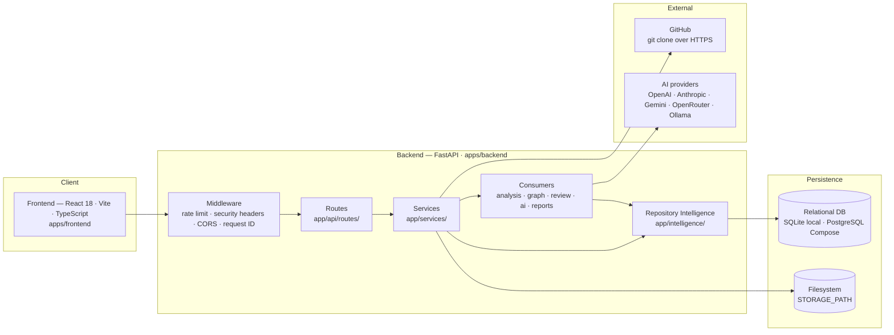
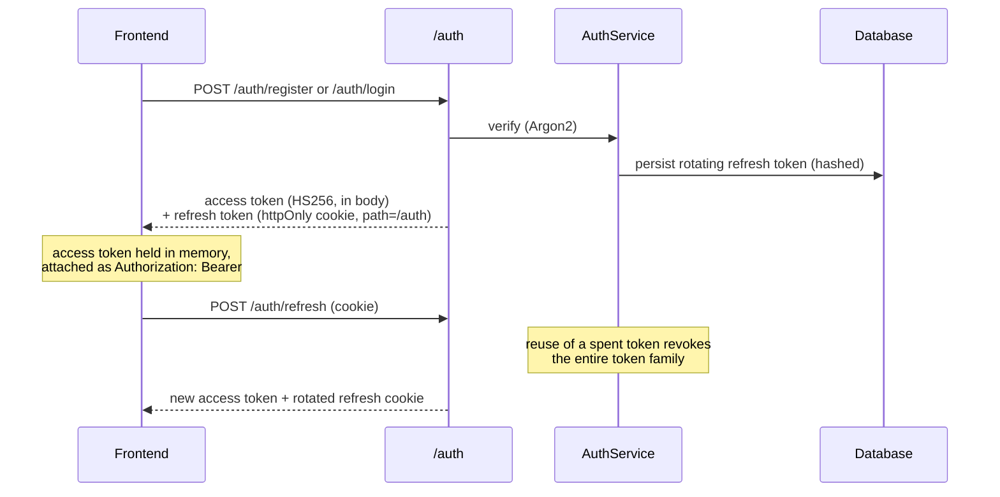
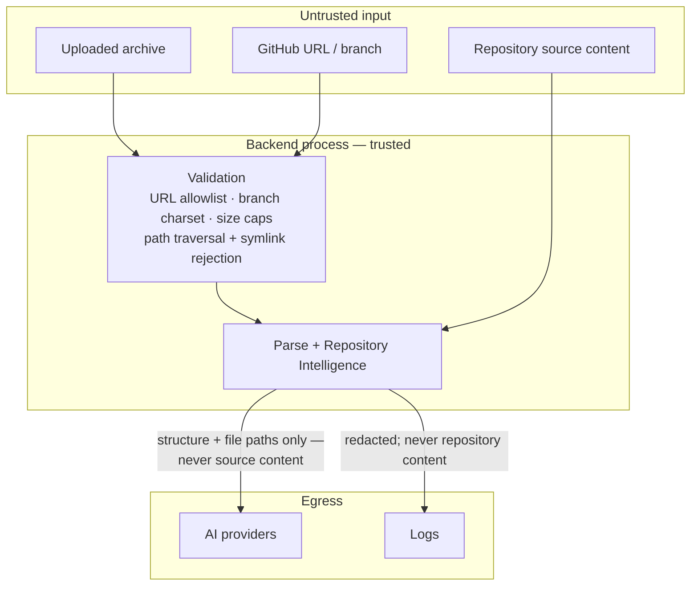

# System Overview

This document describes the system **as it exists today**. Where something is a placeholder, a constant, or a known gap, it says so. Nothing here is aspirational.

Audience: contributors and maintainers who need to know what runs, where the boundaries are, and what they must not break.

---

## Shape of the system

PARTHA is a monorepo: a React frontend, a FastAPI backend, and a local filesystem plus relational database for persistence. There is no message queue, no background worker, and no external analysis service.



---

## Components and responsibilities

### Frontend (`apps/frontend`)

| Area | Responsibility |
| --- | --- |
| `src/app/` | Shell, router, pages, and global stores. Every application route sits behind the `RequireAuth` guard; only `/login` and `/register` are public. |
| `src/features/` | Domain features with colocated hooks, components, and stores: repositories, upload, explorer, architecture, dependencies, review, documentation, AI workspace, insights, auth, settings. |
| `src/shared/` | API clients, error mapping, feature-state helpers, reusable UI, config, and types. All backend calls go through the shared client, which owns access-token attachment and 401 handling. |

### Backend (`apps/backend/app`)

| Module | Responsibility | Must not do |
| --- | --- | --- |
| `api/` | HTTP boundary. Routes stay thin; `deps.py` wires every dependency. | Contain business logic. |
| `services/` | Application services: repository import, analysis orchestration, documentation, AI. | Parse repository files directly. |
| `intelligence/` | **The Repository Intelligence engine.** Builds, persists, and reloads reusable repository facts. | Render API response shapes. |
| `parsers/` | `RepositoryParser` walks the extracted tree and produces the file tree plus basic metadata. `TreeSitterParser` is a **placeholder** — it maps extensions to language names and always returns zero symbols. | Produce feature-specific output. |
| `analysis/` | Architecture model — modules, layers, edges, request-flow hints. **Consumer.** | Read the filesystem. |
| `graph/` | Dependency graph response model. **Consumer.** | Re-read dependency manifests. |
| `review/` | Engineering review findings, scores, roadmap. **Consumer.** | Re-read the filesystem. |
| `ai/` | Context builder, prompt builder, orchestrator, provider registry/factory, and five provider implementations. **Consumer.** | Parse repositories or read source files. |
| `reports/` | `ReportDocument` intermediate representation, builders, and JSON/Markdown/HTML/PDF renderers. **Second-order consumer** — renders analysis output that already exists. | Re-analyse a repository. |
| `auth/` | Argon2 password hashing, HS256 access tokens, rotating refresh tokens with reuse detection. | — |
| `core/` | Settings and validation, database engine, structured logging with redaction, request IDs, metrics, rate limiting, security headers. | — |
| `storage/` | Local filesystem storage for uploads and extracted/cloned repositories. Enforces path safety on extraction. | — |
| `workers/` | **Empty placeholder package.** No background jobs exist. | — |

---

## Ingestion flow

Both entry points converge on the same production path: land the source on disk, compute immutable revision identity, parse it, build the legacy Repository Intelligence model, and persist the repository revision. The normalized `ri.v1` snapshot boundary exists alongside this path but is not populated by the legacy regex engine.

```mermaid
sequenceDiagram
    participant UI as Frontend
    participant API as FastAPI route
    participant Repo as RepositoryService
    participant Store as LocalStorage
    participant Parser as RepositoryParser
    participant RI as RepositoryIntelligenceEngine
    participant DB as Database

    UI->>API: POST /repositories/upload (archive)<br/>or POST /repositories/github (URL)
    API->>Repo: import
    Repo->>Store: save + extract archive, or shallow-clone
    Note over Store: path traversal and symlink escape rejected;<br/>upload and clone size caps enforced
    Store-->>Repo: repository root on disk
    Repo->>Parser: parse(root)
    Parser-->>Repo: FileTreeNode[] + RepositoryMeta + size
    Repo->>RI: build(...)
    RI-->>Repo: RepositoryIntelligence
    Repo->>DB: insert row (revision kind/value/ref + metadata + file_tree + legacy intelligence)
    DB-->>UI: RepositoryResponse
```

This runs **synchronously inside the HTTP request**. A large repository blocks a worker for the whole clone-parse-analyse duration. There is no job queue and no progress streaming; the `analysisStage` and `analysisProgress` fields on the row are set at fixed points, not driven by a real background pipeline.

`POST /analysis/{id}/start` then re-runs the consumers (architecture, dependencies, review) and marks the row complete — also synchronously.

---

## Persistence boundaries

| Store | Holds | Notes |
| --- | --- | --- |
| Relational DB | `users`, `refresh_tokens`, `repositories`, `ai_provider_configs`, and normalized `ri_*` snapshot tables | SQLite by default for local development; PostgreSQL under Docker Compose. The current migration head adds revision identity plus immutable snapshot persistence. |
| `repositories.revision_kind`, `revision_value`, `revision_ref` | Exact imported source identity: Git commit + resolved ref, or upload archive hash. | `revision_value` is indexed and immutable; a moving branch name is metadata, never identity. |
| `repositories.repo_metadata` (JSON column) | Parser metadata and the **legacy/unverified** serialized Repository Intelligence under the `intelligence` key. | New imports no longer stash `commitSha` here. Existing legacy facts are retained for compatibility and are not copied into `ri.v1` observed facts. |
| `ri_snapshots`, `ri_nodes`, `ri_edges`, `ri_assertions`, `ri_observations`, `ri_evidence`, `ri_derivations`, `ri_diagnostics` | Revision-addressed normalized `ri.v1` artifacts, provenance, lifecycle state, and canonical hash. | The persistence boundary and sealing rules are implemented. Syntax-aware producers, query APIs, durable jobs, benchmarks, and consumer migration remain #89–#95, so current product consumers do not read these tables yet. |
| `repositories.file_tree` (JSON column) | The parsed file tree. | Serves the explorer. |
| `ai_provider_configs` | One row per user: provider, model, base URL, and the **Fernet-encrypted** API key plus its last four characters. | Owner-scoped; the plaintext key is never stored and never returned to the client. |
| Filesystem (`STORAGE_PATH`) | Extracted archives and cloned repositories; uploaded archives (deleted after extraction). | Repository source is read from here on demand for file preview. |

AI provider configuration is **per-user and encrypted at rest**. Each user's API key is encrypted with a Fernet key from `AI_ENCRYPTION_KEY` (required outside `development`/`test`), decrypted only in-process at request time, and injected per request — so a query runs against the caller's own key and bill, never a shared one.

---

## Authentication and session flow



The access token is short-lived (15 min default); the refresh token lasts 14 days and rotates on every use. Refresh-token reuse revokes the whole family. `AUTH_SECRET_KEY` is required and length-checked outside `development`/`test`; in dev it falls back to a fixed insecure value.

**Enforcement.** Every non-public route requires a valid access token. The `/repositories`, `/analysis`, `/ai`, `/documentation`, and `/export` routers each apply `get_current_user` at the router level, so a request with no token — or an invalid one — is rejected with 401 before reaching a handler, and a newly added route under those prefixes is protected by default. The pre-auth `get_current_user_or_default` fallback and its `X-Dev-User` header were removed in E1.3; there is no anonymous seed-user bucket. Data is additionally owner-scoped in the service layer (below), so authentication and authorization are enforced independently.

---

## The Repository Intelligence boundary

This is the one architectural invariant of the system.

> **Repository Intelligence is the single repository-understanding boundary. Consumers must not independently parse repositories or construct a second source of repository truth.**

The AI subsystem gets no exemption from this:

> **AI is a consumer of Repository Intelligence and must not independently parse or reinterpret repositories.**

Only two places in the backend read repository source from disk:

1. `RepositoryParser` / `RepositoryIntelligenceEngine`, at build time.
2. `RepositoryService.read_file`, which serves the explorer's file preview — a direct, path-checked read for display only. It feeds no analysis.

Everything else calls `RepositoryIntelligenceEngine.from_record(record)` and transforms the result. See [REPOSITORY_INTELLIGENCE.md](REPOSITORY_INTELLIGENCE.md) for what the engine extracts and what it does not.

### Current consumers

| Consumer | Reads | Produces |
| --- | --- | --- |
| `analysis/` | modules, files, discovery | Architecture nodes, edges, layers, request-flow hints |
| `graph/` | dependencies, `depends_on` relationships | Dependency graph response |
| `review/` | discovery, statistics, file roles and sizes | Findings, category scores, roadmap |
| `services/documentation_service.py` | discovery, files, routes, architecture, dependencies | Markdown / HTML documentation |
| `ai/repository_context.py` | discovery, modules, dependencies, file paths | `RepositoryContext` → `PromptBundle` |
| `reports/` | existing analysis and documentation output | JSON / Markdown / HTML / PDF |

---

## External dependencies

| Dependency | Used for | Failure mode |
| --- | --- | --- |
| `git` (system binary) | Shallow-cloning public GitHub repositories. | Import fails with a normalized external-service error; the partial clone is cleaned up. |
| GitHub (HTTPS) | Source for public repository import. Only `https://github.com/owner/repo` URLs are accepted; no authentication, so no private repositories. | Timeout and size caps abort and clean up. |
| AI providers | Answering repository questions. Configured per user with an encrypted API key; none required. | AI workspace is unusable until the user configures a provider; the rest of the system is unaffected. |
| PostgreSQL, Redis | Compose and CI only. Redis backs the rate limiter when `RATE_LIMIT_BACKEND=redis`. | Local development uses SQLite and the in-memory rate limiter; neither service is required. |

---

## Trust boundaries



- **Uploaded archives and cloned repositories are untrusted input.** Extraction rejects path traversal and symlink escape; upload and clone sizes are capped; only allowlisted archive suffixes are accepted. Repository *content* is never executed — it is only read as text.
- **Repository source never leaves the process.** The AI context builder passes structure and metadata only: languages, frameworks, modules, dependency names, and file paths. No file contents and no line numbers are sent to any provider, and the system prompt explicitly tells the model not to claim line numbers or quote code it was not given.
- **Logs are redacted.** Keys containing `api_key`, `apikey`, `authorization`, `password`, `secret`, or `token` are redacted from structured log extras. Repository contents and credentials must never be logged.
- **The authenticated-user boundary is enforced.** Every non-public route requires a valid token, and every repository lookup is owner-scoped in the service layer, so a caller sees only their own data. Provider API keys are encrypted at rest and injected per user. Rate-limit budgets are keyed on the validated user id for authenticated requests (falling back to the client IP otherwise), so one user cannot spend another's budget.

---

## Current architectural limitations

These are properties of the system as built, not a wish list.

1. **Extraction is heuristic, not language-aware.** File roles, modules, and layers are inferred from path segments and filenames. Symbols come from regular expressions. `TreeSitterParser` returns nothing, even though `tree-sitter` is a declared dependency.
2. **No line-level provenance in production output.** The snapshot schema can store validated spans and derivations, but the current regex engine emits neither and is deliberately not promoted into `ri.v1`.
3. **The graph store has no production producers or consumers yet.** Immutable normalized tables exist, but product surfaces still read the legacy JSON blob. Four of the eight legacy relationship types are never emitted; syntax-aware extraction/resolution and snapshot queries remain later issues.
4. **Processing is synchronous and whole-repository.** No background jobs, no incremental re-analysis, no cancellation.
5. **The rate limiter trusts only the direct socket peer for unauthenticated requests.** `X-Forwarded-For` is deliberately ignored, so behind a reverse proxy every unauthenticated client shares one IP budget until a trusted-proxy allowlist is designed. Authenticated requests are keyed per user and unaffected.
6. **Dependency coverage is narrow.** Three manifest formats, no lockfiles, no transitive resolution, and no vulnerability or outdated-version scanning. The API exposes explicit `not_computed` assessment statuses and does not emit a clean result or count without a scanner.
7. **Frontend assurance is thin.** Coverage is limited and there is no end-to-end suite.

These are missing guarantees in the system as built. They are not scheduled work, and this document does not commit to when or whether any of them change.
